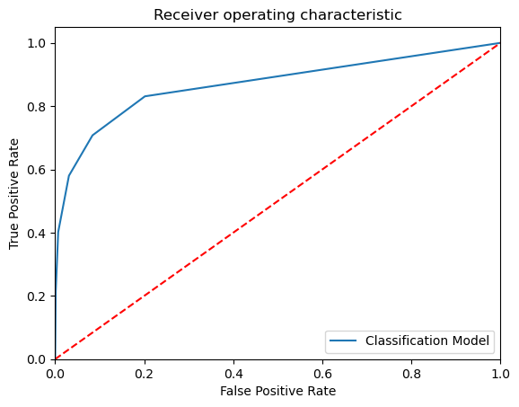

```python
# Importing the libraries 

import pandas as pd
import numpy as np 
import matplotlib.pyplot as plt

# Ignore harmless warnings 

import warnings 
warnings.filterwarnings("ignore")

# Set to display all the columns in dataset

pd.set_option("display.max_columns", None)


```


```python
dt=pd.read_csv(r'ProblemStatement_2.csv')
```


```python
dt.head(10)
```


<div>
<style scoped>
    .dataframe tbody tr th:only-of-type {
        vertical-align: middle;
    }

    .dataframe tbody tr th {
        vertical-align: top;
    }

    .dataframe thead th {
        text-align: right;
    }
</style>
<table border="1" class="dataframe">
  <thead>
    <tr style="text-align: right;">
      <th></th>
      <th>RowNumber</th>
      <th>CustomerId</th>
      <th>Surname</th>
      <th>CreditScore</th>
      <th>Geography</th>
      <th>Gender</th>
      <th>Age</th>
      <th>Tenure</th>
      <th>Balance</th>
      <th>NumOfProducts</th>
      <th>HasCrCard</th>
      <th>IsActiveMember</th>
      <th>EstimatedSalary</th>
      <th>Exited</th>
    </tr>
  </thead>
  <tbody>
    <tr>
      <th>0</th>
      <td>1</td>
      <td>15634602</td>
      <td>Hargrave</td>
      <td>619</td>
      <td>France</td>
      <td>Female</td>
      <td>42</td>
      <td>2</td>
      <td>0.00</td>
      <td>1</td>
      <td>1</td>
      <td>1</td>
      <td>101348.88</td>
      <td>1</td>
    </tr>
    <tr>
      <th>1</th>
      <td>2</td>
      <td>15647311</td>
      <td>Hill</td>
      <td>608</td>
      <td>Spain</td>
      <td>Female</td>
      <td>41</td>
      <td>1</td>
      <td>83807.86</td>
      <td>1</td>
      <td>0</td>
      <td>1</td>
      <td>112542.58</td>
      <td>0</td>
    </tr>
    <tr>
      <th>2</th>
      <td>3</td>
      <td>15619304</td>
      <td>Onio</td>
      <td>502</td>
      <td>France</td>
      <td>Female</td>
      <td>42</td>
      <td>8</td>
      <td>159660.80</td>
      <td>3</td>
      <td>1</td>
      <td>0</td>
      <td>113931.57</td>
      <td>1</td>
    </tr>
    <tr>
      <th>3</th>
      <td>4</td>
      <td>15701354</td>
      <td>Boni</td>
      <td>699</td>
      <td>France</td>
      <td>Female</td>
      <td>39</td>
      <td>1</td>
      <td>0.00</td>
      <td>2</td>
      <td>0</td>
      <td>0</td>
      <td>93826.63</td>
      <td>0</td>
    </tr>
    <tr>
      <th>4</th>
      <td>5</td>
      <td>15737888</td>
      <td>Mitchell</td>
      <td>850</td>
      <td>Spain</td>
      <td>Female</td>
      <td>43</td>
      <td>2</td>
      <td>125510.82</td>
      <td>1</td>
      <td>1</td>
      <td>1</td>
      <td>79084.10</td>
      <td>0</td>
    </tr>
    <tr>
      <th>5</th>
      <td>6</td>
      <td>15574012</td>
      <td>Chu</td>
      <td>645</td>
      <td>Spain</td>
      <td>Male</td>
      <td>44</td>
      <td>8</td>
      <td>113755.78</td>
      <td>2</td>
      <td>1</td>
      <td>0</td>
      <td>149756.71</td>
      <td>1</td>
    </tr>
    <tr>
      <th>6</th>
      <td>7</td>
      <td>15592531</td>
      <td>Bartlett</td>
      <td>822</td>
      <td>France</td>
      <td>Male</td>
      <td>50</td>
      <td>7</td>
      <td>0.00</td>
      <td>2</td>
      <td>1</td>
      <td>1</td>
      <td>10062.80</td>
      <td>0</td>
    </tr>
    <tr>
      <th>7</th>
      <td>8</td>
      <td>15656148</td>
      <td>Obinna</td>
      <td>376</td>
      <td>Germany</td>
      <td>Female</td>
      <td>29</td>
      <td>4</td>
      <td>115046.74</td>
      <td>4</td>
      <td>1</td>
      <td>0</td>
      <td>119346.88</td>
      <td>1</td>
    </tr>
    <tr>
      <th>8</th>
      <td>9</td>
      <td>15792365</td>
      <td>He</td>
      <td>501</td>
      <td>France</td>
      <td>Male</td>
      <td>44</td>
      <td>4</td>
      <td>142051.07</td>
      <td>2</td>
      <td>0</td>
      <td>1</td>
      <td>74940.50</td>
      <td>0</td>
    </tr>
    <tr>
      <th>9</th>
      <td>10</td>
      <td>15592389</td>
      <td>H?</td>
      <td>684</td>
      <td>France</td>
      <td>Male</td>
      <td>27</td>
      <td>2</td>
      <td>134603.88</td>
      <td>1</td>
      <td>1</td>
      <td>1</td>
      <td>71725.73</td>
      <td>0</td>
    </tr>
  </tbody>
</table>
</div>


```python
dt.corr
```


    <bound method DataFrame.corr of       RowNumber  CustomerId    Surname  CreditScore Geography  Gender  Age  \
    0             1    15634602   Hargrave          619    France  Female   42   
    1             2    15647311       Hill          608     Spain  Female   41   
    2             3    15619304       Onio          502    France  Female   42   
    3             4    15701354       Boni          699    France  Female   39   
    4             5    15737888   Mitchell          850     Spain  Female   43   
    ...         ...         ...        ...          ...       ...     ...  ...   
    9995       9996    15606229   Obijiaku          771    France    Male   39   
    9996       9997    15569892  Johnstone          516    France    Male   35   
    9997       9998    15584532        Liu          709    France  Female   36   
    9998       9999    15682355  Sabbatini          772   Germany    Male   42   
    9999      10000    15628319     Walker          792    France  Female   28   
    
          Tenure    Balance  NumOfProducts  HasCrCard  IsActiveMember  \
    0          2       0.00              1          1               1   
    1          1   83807.86              1          0               1   
    2          8  159660.80              3          1               0   
    3          1       0.00              2          0               0   
    4          2  125510.82              1          1               1   
    ...      ...        ...            ...        ...             ...   
    9995       5       0.00              2          1               0   
    9996      10   57369.61              1          1               1   
    9997       7       0.00              1          0               1   
    9998       3   75075.31              2          1               0   
    9999       4  130142.79              1          1               0   
    
          EstimatedSalary  Exited  
    0           101348.88       1  
    1           112542.58       0  
    2           113931.57       1  
    3            93826.63       0  
    4            79084.10       0  
    ...               ...     ...  
    9995         96270.64       0  
    9996        101699.77       0  
    9997         42085.58       1  
    9998         92888.52       1  
    9999         38190.78       0  
    
    [10000 rows x 14 columns]>


```python
dt.describe()
```


<div>
<style scoped>
    .dataframe tbody tr th:only-of-type {
        vertical-align: middle;
    }

    .dataframe tbody tr th {
        vertical-align: top;
    }

    .dataframe thead th {
        text-align: right;
    }
</style>
<table border="1" class="dataframe">
  <thead>
    <tr style="text-align: right;">
      <th></th>
      <th>RowNumber</th>
      <th>CustomerId</th>
      <th>CreditScore</th>
      <th>Age</th>
      <th>Tenure</th>
      <th>Balance</th>
      <th>NumOfProducts</th>
      <th>HasCrCard</th>
      <th>IsActiveMember</th>
      <th>EstimatedSalary</th>
      <th>Exited</th>
    </tr>
  </thead>
  <tbody>
    <tr>
      <th>count</th>
      <td>10000.00000</td>
      <td>1.000000e+04</td>
      <td>10000.000000</td>
      <td>10000.000000</td>
      <td>10000.000000</td>
      <td>10000.000000</td>
      <td>10000.000000</td>
      <td>10000.00000</td>
      <td>10000.000000</td>
      <td>10000.000000</td>
      <td>10000.000000</td>
    </tr>
    <tr>
      <th>mean</th>
      <td>5000.50000</td>
      <td>1.569094e+07</td>
      <td>650.528800</td>
      <td>38.921800</td>
      <td>5.012800</td>
      <td>76485.889288</td>
      <td>1.530200</td>
      <td>0.70550</td>
      <td>0.515100</td>
      <td>100090.239881</td>
      <td>0.203700</td>
    </tr>
    <tr>
      <th>std</th>
      <td>2886.89568</td>
      <td>7.193619e+04</td>
      <td>96.653299</td>
      <td>10.487806</td>
      <td>2.892174</td>
      <td>62397.405202</td>
      <td>0.581654</td>
      <td>0.45584</td>
      <td>0.499797</td>
      <td>57510.492818</td>
      <td>0.402769</td>
    </tr>
    <tr>
      <th>min</th>
      <td>1.00000</td>
      <td>1.556570e+07</td>
      <td>350.000000</td>
      <td>18.000000</td>
      <td>0.000000</td>
      <td>0.000000</td>
      <td>1.000000</td>
      <td>0.00000</td>
      <td>0.000000</td>
      <td>11.580000</td>
      <td>0.000000</td>
    </tr>
    <tr>
      <th>25%</th>
      <td>2500.75000</td>
      <td>1.562853e+07</td>
      <td>584.000000</td>
      <td>32.000000</td>
      <td>3.000000</td>
      <td>0.000000</td>
      <td>1.000000</td>
      <td>0.00000</td>
      <td>0.000000</td>
      <td>51002.110000</td>
      <td>0.000000</td>
    </tr>
    <tr>
      <th>50%</th>
      <td>5000.50000</td>
      <td>1.569074e+07</td>
      <td>652.000000</td>
      <td>37.000000</td>
      <td>5.000000</td>
      <td>97198.540000</td>
      <td>1.000000</td>
      <td>1.00000</td>
      <td>1.000000</td>
      <td>100193.915000</td>
      <td>0.000000</td>
    </tr>
    <tr>
      <th>75%</th>
      <td>7500.25000</td>
      <td>1.575323e+07</td>
      <td>718.000000</td>
      <td>44.000000</td>
      <td>7.000000</td>
      <td>127644.240000</td>
      <td>2.000000</td>
      <td>1.00000</td>
      <td>1.000000</td>
      <td>149388.247500</td>
      <td>0.000000</td>
    </tr>
    <tr>
      <th>max</th>
      <td>10000.00000</td>
      <td>1.581569e+07</td>
      <td>850.000000</td>
      <td>92.000000</td>
      <td>10.000000</td>
      <td>250898.090000</td>
      <td>4.000000</td>
      <td>1.00000</td>
      <td>1.000000</td>
      <td>199992.480000</td>
      <td>1.000000</td>
    </tr>
  </tbody>
</table>
</div>


```python
dt.shape
```


    (10000, 14)


```python
dt.isnull().sum()
# SimpleImputer(missing_values=np.nan, strategy='mean', fill_value=None, verbose=0, copy=True, add_indicator=False)

#from sklearn.impute import SimpleImputer

# SimpleImputer(missing_values=nan, strategy='mean', fill_value=None, verbose='deprecated', copy=True, 
# add_indicator=False, keep_empty_features=False)

#imputer_si = SimpleImputer(missing_values=np.nan, strategy='most_frequent')

#Claims_BK1['Policy_Type'] = imputer_si.fit_transform(Claims_BK1[['Policy_Type']])
#Claims_BK1['Pre_Claims'] = imputer_si.fit_transform(Claims_BK1[['Pre_Claims']])

#Claims_BK1
```


    RowNumber          0
    CustomerId         0
    Surname            0
    CreditScore        0
    Geography          0
    Gender             0
    Age                0
    Tenure             0
    Balance            0
    NumOfProducts      0
    HasCrCard          0
    IsActiveMember     0
    EstimatedSalary    0
    Exited             0
    dtype: int64


```python
dt.duplicated().any()
#dt=dt.drop_duplicates()
```


    False


```python
# Use LabelEncoder to handle categorical data

from sklearn.preprocessing import LabelEncoder

LE = LabelEncoder()

for col in dt.columns:
    if dt[col].dtypes=='object':
        dt[col]=LE.fit_transform(dt[col])
```


```python
dt.info()
```

    <class 'pandas.core.frame.DataFrame'>
    RangeIndex: 10000 entries, 0 to 9999
    Data columns (total 14 columns):
     #   Column           Non-Null Count  Dtype  
    ---  ------           --------------  -----  
     0   RowNumber        10000 non-null  int64  
     1   CustomerId       10000 non-null  int64  
     2   Surname          10000 non-null  int64  
     3   CreditScore      10000 non-null  int64  
     4   Geography        10000 non-null  int64  
     5   Gender           10000 non-null  int64  
     6   Age              10000 non-null  int64  
     7   Tenure           10000 non-null  int64  
     8   Balance          10000 non-null  float64
     9   NumOfProducts    10000 non-null  int64  
     10  HasCrCard        10000 non-null  int64  
     11  IsActiveMember   10000 non-null  int64  
     12  EstimatedSalary  10000 non-null  float64
     13  Exited           10000 non-null  int64  
    dtypes: float64(2), int64(12)
    memory usage: 1.1 MB


```python
# Identify the Independent and Target variables

IndepVar = []
for col in dt.columns:
    if col != 'Exited':
        IndepVar.append(col)

TargetVar = 'Exited'

x = dt[IndepVar]
y = dt[TargetVar]
```


```python
# Splitting the dataset into train and test 

from sklearn.model_selection import train_test_split

x_train, x_test, y_train, y_test = train_test_split(x, y, test_size = 0.30, random_state = 42)

# Display the shape of train and test data 

x_train.shape, x_test.shape, y_train.shape, y_test.shape
```


    ((7000, 13), (3000, 13), (7000,), (3000,))


```python
EMResults = pd.read_csv(r'/Users/rohit/Downloads/EMResults-2.csv')
```


```python
# To build the 'Decision Tree' model with random sampling

from sklearn.tree import DecisionTreeClassifier 

# Create an object for model

ModelDT = DecisionTreeClassifier()
#ModelDT = DecisionTreeClassifier(criterion='gini', splitter='best', max_depth=None, min_samples_split=2, 
#                                 min_samples_leaf=1, min_weight_fraction_leaf=0.0, max_features=None, 
#                                 random_state=None, max_leaf_nodes=None, min_impurity_decrease=0.0, 
#                                 class_weight=None, ccp_alpha=0.0)

# Train the model with train data 

ModelDT.fit(x_train,y_train)

# Predict the model with test data set

y_pred = ModelDT.predict(x_test)
y_pred_prob = ModelDT.predict_proba(x_test)

# Confusion matrix in sklearn

from sklearn.metrics import confusion_matrix
from sklearn.metrics import classification_report

# actual values

actual = y_test

# predicted values

predicted = y_pred

# confusion matrix

matrix = confusion_matrix(actual,predicted, labels=[1,0],sample_weight=None, normalize=None)
print('Confusion matrix : \n', matrix)

# outcome values order in sklearn

tp, fn, fp, tn = confusion_matrix(actual,predicted,labels=[1,0]).reshape(-1)
print('Outcome values : \n', tp, fn, fp, tn)

# classification report for precision, recall f1-score and accuracy

C_Report = classification_report(actual,predicted,labels=[1,0])

print('Classification report : \n', C_Report)

# calculating the metrics

sensitivity = round(tp/(tp+fn), 3);
specificity = round(tn/(tn+fp), 3);
accuracy = round((tp+tn)/(tp+fp+tn+fn), 3);
balanced_accuracy = round((sensitivity+specificity)/2, 3);
precision = round(tp/(tp+fp), 3);
f1Score = round((2*tp/(2*tp + fp + fn)), 3);

# Matthews Correlation Coefficient (MCC). Range of values of MCC lie between -1 to +1. 
# A model with a score of +1 is a perfect model and -1 is a poor model

from math import sqrt

mx = (tp+fp) * (tp+fn) * (tn+fp) * (tn+fn)
MCC = round(((tp * tn) - (fp * fn)) / sqrt(mx), 3)

print('Accuracy :', round(accuracy*100, 2),'%')
print('Precision :', round(precision*100, 2),'%')
print('Recall :', round(sensitivity*100,2), '%')
print('F1 Score :', f1Score)
print('Specificity or True Negative Rate :', round(specificity*100,2), '%'  )
print('Balanced Accuracy :', round(balanced_accuracy*100, 2),'%')
print('MCC :', MCC)

# Area under ROC curve 

from sklearn.metrics import roc_curve, roc_auc_score

print('roc_auc_score:', round(roc_auc_score(actual, predicted), 3))

# ROC Curve

from sklearn.metrics import roc_auc_score
from sklearn.metrics import roc_curve
model_roc_auc = roc_auc_score(actual, predicted)
fpr, tpr, thresholds = roc_curve(actual, ModelDT.predict_proba(x_test)[:,1])
plt.figure()
# plt.plot(fpr, tpr, label='Logistic Regression (area = %0.2f)' % logit_roc_auc)
plt.plot(fpr, tpr, label= 'Classification Model' % model_roc_auc)
plt.plot([0, 1], [0, 1],'r--')
plt.xlim([0.0, 1.0])
plt.ylim([0.0, 1.05])
plt.xlabel('False Positive Rate')
plt.ylabel('True Positive Rate')
plt.title('Receiver operating characteristic')
plt.legend(loc="lower right")
plt.show() 
print('-----------------------------------------------------------------------------------------------------')
```

    Confusion matrix : 
     [[ 295  289]
     [ 324 2092]]
    Outcome values : 
     295 289 324 2092
    Classification report : 
                   precision    recall  f1-score   support
    
               1       0.48      0.51      0.49       584
               0       0.88      0.87      0.87      2416
    
        accuracy                           0.80      3000
       macro avg       0.68      0.69      0.68      3000
    weighted avg       0.80      0.80      0.80      3000
    
    Accuracy : 79.6 %
    Precision : 47.7 %
    Recall : 50.5 %
    F1 Score : 0.49
    Specificity or True Negative Rate : 86.6 %
    Balanced Accuracy : 68.6 %
    MCC : 0.363
    roc_auc_score: 0.686


    

    


    -----------------------------------------------------------------------------------------------------


```python
!pip install lightgbm
```

    Collecting lightgbm
      Downloading lightgbm-4.1.0.tar.gz (1.7 MB)
         ━━━━━━━━━━━━━━━━━━━━━━━━━━━━━━━━━━━━━━━━ 1.7/1.7 MB 1.5 MB/s eta 0:00:0000:0100:010m
    [?25h  Installing build dependencies ... [?25ldone
    [?25h  Getting requirements to build wheel ... [?25ldone
    [?25h  Installing backend dependencies ... [?25ldone
    [?25h  Preparing metadata (pyproject.toml) ... [?25ldone
    [?25hRequirement already satisfied: scipy in ./anaconda3/lib/python3.10/site-packages (from lightgbm) (1.10.0)
    Requirement already satisfied: numpy in ./anaconda3/lib/python3.10/site-packages (from lightgbm) (1.23.5)
    Building wheels for collected packages: lightgbm
      Building wheel for lightgbm (pyproject.toml) ... [?25lerror
      error: subprocess-exited-with-error
      
      × Building wheel for lightgbm (pyproject.toml) did not run successfully.
      │ exit code: 1
      ╰─> [46 lines of output]
          2023-12-13 14:42:20,339 - scikit_build_core - INFO - CMake version: 3.28.0
          *** scikit-build-core 0.7.0 using CMake 3.28.0 (wheel)
          2023-12-13 14:42:20,342 - scikit_build_core - INFO - Build directory: /private/var/folders/p9/z_95c3fn7ds35gtb7jvgs5sm0000gn/T/tmplwtsqvc_/build
          *** Configuring CMake...
          2023-12-13 14:42:20,879 - scikit_build_core - INFO - Ninja version: 1.11.1
          2023-12-13 14:42:20,881 - scikit_build_core - WARNING - libdir/ldlibrary: /Users/rohit/anaconda3/lib/libpython3.10.a is not a real file!
          2023-12-13 14:42:20,881 - scikit_build_core - WARNING - Can't find a Python library, got libdir=/Users/rohit/anaconda3/lib, ldlibrary=libpython3.10.a, multiarch=darwin, masd=None
          loading initial cache file /var/folders/p9/z_95c3fn7ds35gtb7jvgs5sm0000gn/T/tmplwtsqvc_/build/CMakeInit.txt
          CMake Deprecation Warning at CMakeLists.txt:35 (cmake_minimum_required):
            Compatibility with CMake < 3.5 will be removed from a future version of
            CMake.
          
            Update the VERSION argument <min> value or use a ...<max> suffix to tell
            CMake that the project does not need compatibility with older versions.
          
          
          -- The C compiler identification is AppleClang 15.0.0.15000040
          -- The CXX compiler identification is AppleClang 15.0.0.15000040
          -- Detecting C compiler ABI info
          -- Detecting C compiler ABI info - done
          -- Check for working C compiler: /Library/Developer/CommandLineTools/usr/bin/cc - skipped
          -- Detecting C compile features
          -- Detecting C compile features - done
          -- Detecting CXX compiler ABI info
          -- Detecting CXX compiler ABI info - done
          -- Check for working CXX compiler: /Library/Developer/CommandLineTools/usr/bin/c++ - skipped
          -- Detecting CXX compile features
          -- Detecting CXX compile features - done
          -- Could NOT find OpenMP_C (missing: OpenMP_C_FLAGS OpenMP_C_LIB_NAMES)
          -- Could NOT find OpenMP_CXX (missing: OpenMP_CXX_FLAGS OpenMP_CXX_LIB_NAMES)
          -- Could NOT find OpenMP (missing: OpenMP_C_FOUND OpenMP_CXX_FOUND)
          -- Found OpenMP_C: -Xpreprocessor -fopenmp -I/include
          -- Found OpenMP_CXX: -Xpreprocessor -fopenmp -I/include
          -- Found OpenMP: TRUE
          -- Performing Test MM_PREFETCH
          -- Performing Test MM_PREFETCH - Failed
          -- Performing Test MM_MALLOC
          -- Performing Test MM_MALLOC - Success
          -- Using _mm_malloc
          -- Configuring done (4.3s)
          -- Generating done (0.0s)
          -- Build files have been written to: /var/folders/p9/z_95c3fn7ds35gtb7jvgs5sm0000gn/T/tmplwtsqvc_/build
          *** Building project with Ninja...
          ninja: error: '/lib/libomp.dylib', needed by '/private/var/folders/p9/z_95c3fn7ds35gtb7jvgs5sm0000gn/T/pip-install-ozn7q91u/lightgbm_ea8320d70ffa48d897a4cdaf6e110e0c/lib_lightgbm.so', missing and no known rule to make it
          
          *** CMake build failed
          [end of output]
      
      note: This error originates from a subprocess, and is likely not a problem with pip.
      ERROR: Failed building wheel for lightgbm
    [?25hFailed to build lightgbm
    ERROR: Could not build wheels for lightgbm, which is required to install pyproject.toml-based projects
    


```python
!pip install xgboost
```

    Requirement already satisfied: xgboost in ./anaconda3/lib/python3.10/site-packages (1.7.6)
    Requirement already satisfied: scipy in ./anaconda3/lib/python3.10/site-packages (from xgboost) (1.10.0)
    Requirement already satisfied: numpy in ./anaconda3/lib/python3.10/site-packages (from xgboost) (1.23.5)


```python
# Build the Calssification models and compare the results

#from sklearn.linear_model import LogisticRegression
from sklearn.tree import DecisionTreeClassifier
from sklearn.ensemble import RandomForestClassifier
from sklearn.naive_bayes import GaussianNB
#from sklearn.svm import SVC
from sklearn.ensemble import ExtraTreesClassifier
from sklearn.neighbors import KNeighborsClassifier
#from sklearn.naive_bayes import GaussianNB
#from xgboost import XGBClassifier
#from sklearn import lightgbm as lgb

# Create objects of classification algorithm with default hyper-parameters

#ModelLR = LogisticRegression()
ModelDC = DecisionTreeClassifier()
ModelRF = RandomForestClassifier()
ModelET = ExtraTreesClassifier()
ModelKNN = KNeighborsClassifier(n_neighbors=5)
ModelGNB = GaussianNB()
#ModelSVM = SVC(probability=True)
#ModelXGB = XGBClassifier(n_estimators=100, max_depth=3, eval_metric='mlogloss')
#ModelLGB = lgb.LGBMClassifier()

# Evalution matrix for all the algorithms

#MM = [ModelLR, ModelDC, ModelRF, ModelKNN, ModelGNB, ModelSVM, modelXGB, modelLGB]
MM = [ModelDC, ModelRF, ModelGNB, ModelKNN, ModelDC]

for models in MM:
    
    # Fit the modeltrain data
    
    models.fit(x_train, y_train)
    
    # Prediction the model with test data 
    
    y_pred = models.predict(x_test)
    y_pred_prob = models.predict_proba(x_test)
    
    # Print the model name
    
    print('Model Name: ', models)
    
    # confusion matrix in sklearn

    from sklearn.metrics import confusion_matrix
    from sklearn.metrics import classification_report

    # actual values

    actual = y_test

    # predicted values

    predicted = y_pred

    # confusion matrix

    matrix = confusion_matrix(actual,predicted, labels=[1,0],sample_weight=None, normalize=None)
    print('Confusion matrix : \n', matrix)

    # outcome values order in sklearn

    tp, fn, fp, tn = confusion_matrix(actual,predicted,labels=[1,0]).reshape(-1)
    print('Outcome values : \n', tp, fn, fp, tn)

    # classification report for precision, recall f1-score and accuracy

    C_Report = classification_report(actual,predicted,labels=[1,0])

    print('Classification report : \n', C_Report)

    # calculating the metrics

    sensitivity = round(tp/(tp+fn), 3);
    specificity = round(tn/(tn+fp), 3);
    accuracy = round((tp+tn)/(tp+fp+tn+fn), 3);
    balanced_accuracy = round((sensitivity+specificity)/2, 3);
    
    precision = round(tp/(tp+fp), 3);
    f1Score = round((2*tp/(2*tp + fp + fn)), 3);

    # Matthews Correlation Coefficient (MCC). Range of values of MCC lie between -1 to +1. 
    # A model with a score of +1 is a perfect model and -1 is a poor model

    from math import sqrt

    mx = (tp+fp) * (tp+fn) * (tn+fp) * (tn+fn)
    MCC = round(((tp * tn) - (fp * fn)) / sqrt(mx), 3)

    print('Accuracy :', round(accuracy*100, 2),'%')
    print('Precision :', round(precision*100, 2),'%')
    print('Recall :', round(sensitivity*100,2), '%')
    print('F1 Score :', f1Score)
    print('Specificity or True Negative Rate :', round(specificity*100,2), '%'  )
    print('Balanced Accuracy :', round(balanced_accuracy*100, 2),'%')
    print('MCC :', MCC)

    # Area under ROC curve 

    from sklearn.metrics import roc_curve, roc_auc_score

    print('roc_auc_score:', round(roc_auc_score(actual, predicted), 3))
    
    # ROC Curve
    
    from sklearn.metrics import roc_auc_score
    from sklearn.metrics import roc_curve
    model_roc_auc = roc_auc_score(actual, predicted)
    fpr, tpr, thresholds = roc_curve(actual, models.predict_proba(x_test)[:,1])
    plt.figure()
    # plt.plot(fpr, tpr, label='Logistic Regression (area = %0.2f)' % logit_roc_auc)
    plt.plot(fpr, tpr, label= 'Classification Model' % model_roc_auc)
    plt.plot([0, 1], [0, 1],'r--')
    plt.xlim([0.0, 1.0])
    plt.ylim([0.0, 1.05])
    plt.xlabel('False Positive Rate')
    plt.ylabel('True Positive Rate')
    plt.title('Receiver operating characteristic')
    plt.legend(loc="lower right")
    plt.savefig('Log_ROC')
    plt.show()
    print('-----------------------------------------------------------------------------------------------------')
    #---
    new_row = {'Model Name' : models,
               'True_Positive' : tp, 
               'False_Negative' : fn, 
               'False_Positive' : fp,
               'True_Negative' : tn,
               'Accuracy' : accuracy,
               'Precision' : precision,
               'Recall' : sensitivity,
               'F1 Score' : f1Score,
               'Specificity' : specificity,
               'MCC':MCC,
               'ROC_AUC_Score':roc_auc_score(actual, predicted),
               'Balanced Accuracy':balanced_accuracy}
    EMResults = EMResults.append(new_row, ignore_index=True)
    #---
```

    Model Name:  DecisionTreeClassifier()
    Confusion matrix : 
     [[ 289  295]
     [ 336 2080]]
    Outcome values : 
     289 295 336 2080
    Classification report : 
                   precision    recall  f1-score   support
    
               1       0.46      0.49      0.48       584
               0       0.88      0.86      0.87      2416
    
        accuracy                           0.79      3000
       macro avg       0.67      0.68      0.67      3000
    weighted avg       0.80      0.79      0.79      3000
    
    Accuracy : 79.0 %
    Precision : 46.2 %
    Recall : 49.5 %
    F1 Score : 0.478
    Specificity or True Negative Rate : 86.1 %
    Balanced Accuracy : 67.8 %
    MCC : 0.347
    roc_auc_score: 0.678


    

    


    -----------------------------------------------------------------------------------------------------
    Model Name:  RandomForestClassifier()
    Confusion matrix : 
     [[ 258  326]
     [  60 2356]]
    Outcome values : 
     258 326 60 2356
    Classification report : 
                   precision    recall  f1-score   support
    
               1       0.81      0.44      0.57       584
               0       0.88      0.98      0.92      2416
    
        accuracy                           0.87      3000
       macro avg       0.84      0.71      0.75      3000
    weighted avg       0.87      0.87      0.86      3000
    
    Accuracy : 87.1 %
    Precision : 81.1 %
    Recall : 44.2 %
    F1 Score : 0.572
    Specificity or True Negative Rate : 97.5 %
    Balanced Accuracy : 70.8 %
    MCC : 0.536
    roc_auc_score: 0.708


    

    


    -----------------------------------------------------------------------------------------------------
    Model Name:  GaussianNB()
    Confusion matrix : 
     [[  43  541]
     [  82 2334]]
    Outcome values : 
     43 541 82 2334
    Classification report : 
                   precision    recall  f1-score   support
    
               1       0.34      0.07      0.12       584
               0       0.81      0.97      0.88      2416
    
        accuracy                           0.79      3000
       macro avg       0.58      0.52      0.50      3000
    weighted avg       0.72      0.79      0.73      3000
    
    Accuracy : 79.2 %
    Precision : 34.4 %
    Recall : 7.4 %
    F1 Score : 0.121
    Specificity or True Negative Rate : 96.6 %
    Balanced Accuracy : 52.0 %
    MCC : 0.079
    roc_auc_score: 0.52


    

    


    -----------------------------------------------------------------------------------------------------
    Model Name:  KNeighborsClassifier()
    Confusion matrix : 
     [[  52  532]
     [ 165 2251]]
    Outcome values : 
     52 532 165 2251
    Classification report : 
                   precision    recall  f1-score   support
    
               1       0.24      0.09      0.13       584
               0       0.81      0.93      0.87      2416
    
        accuracy                           0.77      3000
       macro avg       0.52      0.51      0.50      3000
    weighted avg       0.70      0.77      0.72      3000
    
    Accuracy : 76.8 %
    Precision : 24.0 %
    Recall : 8.9 %
    F1 Score : 0.13
    Specificity or True Negative Rate : 93.2 %
    Balanced Accuracy : 51.1 %
    MCC : 0.032
    roc_auc_score: 0.51


    

    


    -----------------------------------------------------------------------------------------------------
    Model Name:  DecisionTreeClassifier()
    Confusion matrix : 
     [[ 288  296]
     [ 346 2070]]
    Outcome values : 
     288 296 346 2070
    Classification report : 
                   precision    recall  f1-score   support
    
               1       0.45      0.49      0.47       584
               0       0.87      0.86      0.87      2416
    
        accuracy                           0.79      3000
       macro avg       0.66      0.67      0.67      3000
    weighted avg       0.79      0.79      0.79      3000
    
    Accuracy : 78.6 %
    Precision : 45.4 %
    Recall : 49.3 %
    F1 Score : 0.473
    Specificity or True Negative Rate : 85.7 %
    Balanced Accuracy : 67.5 %
    MCC : 0.339
    roc_auc_score: 0.675


    

    


    -----------------------------------------------------------------------------------------------------


```python
EMResults.head()
```


<div>
<style scoped>
    .dataframe tbody tr th:only-of-type {
        vertical-align: middle;
    }

    .dataframe tbody tr th {
        vertical-align: top;
    }

    .dataframe thead th {
        text-align: right;
    }
</style>
<table border="1" class="dataframe">
  <thead>
    <tr style="text-align: right;">
      <th></th>
      <th>Model Name</th>
      <th>True_Positive</th>
      <th>False_Negative</th>
      <th>False_Positive</th>
      <th>True_Negative</th>
      <th>Accuracy</th>
      <th>Precision</th>
      <th>Recall</th>
      <th>F1 Score</th>
      <th>Specificity</th>
      <th>MCC</th>
      <th>ROC_AUC_Score</th>
      <th>Balanced Accuracy</th>
    </tr>
  </thead>
  <tbody>
    <tr>
      <th>0</th>
      <td>DecisionTreeClassifier()</td>
      <td>289</td>
      <td>295</td>
      <td>336</td>
      <td>2080</td>
      <td>0.790</td>
      <td>0.462</td>
      <td>0.495</td>
      <td>0.478</td>
      <td>0.861</td>
      <td>0.347</td>
      <td>0.677895</td>
      <td>0.678</td>
    </tr>
    <tr>
      <th>1</th>
      <td>(DecisionTreeClassifier(max_features='sqrt', r...</td>
      <td>258</td>
      <td>326</td>
      <td>60</td>
      <td>2356</td>
      <td>0.871</td>
      <td>0.811</td>
      <td>0.442</td>
      <td>0.572</td>
      <td>0.975</td>
      <td>0.536</td>
      <td>0.708473</td>
      <td>0.708</td>
    </tr>
    <tr>
      <th>2</th>
      <td>GaussianNB()</td>
      <td>43</td>
      <td>541</td>
      <td>82</td>
      <td>2334</td>
      <td>0.792</td>
      <td>0.344</td>
      <td>0.074</td>
      <td>0.121</td>
      <td>0.966</td>
      <td>0.079</td>
      <td>0.519845</td>
      <td>0.520</td>
    </tr>
    <tr>
      <th>3</th>
      <td>KNeighborsClassifier()</td>
      <td>52</td>
      <td>532</td>
      <td>165</td>
      <td>2251</td>
      <td>0.768</td>
      <td>0.240</td>
      <td>0.089</td>
      <td>0.130</td>
      <td>0.932</td>
      <td>0.032</td>
      <td>0.510373</td>
      <td>0.511</td>
    </tr>
    <tr>
      <th>4</th>
      <td>DecisionTreeClassifier()</td>
      <td>288</td>
      <td>296</td>
      <td>346</td>
      <td>2070</td>
      <td>0.786</td>
      <td>0.454</td>
      <td>0.493</td>
      <td>0.473</td>
      <td>0.857</td>
      <td>0.339</td>
      <td>0.674969</td>
      <td>0.675</td>
    </tr>
  </tbody>
</table>
</div>


```python
Results = pd.DataFrame({'target_A':y_test, 'target_P':y_pred})

# Merge two Dataframes on index of both the dataframes

ResultsFinal = dt.merge(Results, left_index=True, right_index=True)
ResultsFinal.head()
```


<div>
<style scoped>
    .dataframe tbody tr th:only-of-type {
        vertical-align: middle;
    }

    .dataframe tbody tr th {
        vertical-align: top;
    }

    .dataframe thead th {
        text-align: right;
    }
</style>
<table border="1" class="dataframe">
  <thead>
    <tr style="text-align: right;">
      <th></th>
      <th>RowNumber</th>
      <th>CustomerId</th>
      <th>Surname</th>
      <th>CreditScore</th>
      <th>Geography</th>
      <th>Gender</th>
      <th>Age</th>
      <th>Tenure</th>
      <th>Balance</th>
      <th>NumOfProducts</th>
      <th>HasCrCard</th>
      <th>IsActiveMember</th>
      <th>EstimatedSalary</th>
      <th>Exited</th>
      <th>target_A</th>
      <th>target_P</th>
    </tr>
  </thead>
  <tbody>
    <tr>
      <th>0</th>
      <td>1</td>
      <td>15634602</td>
      <td>1115</td>
      <td>619</td>
      <td>0</td>
      <td>0</td>
      <td>42</td>
      <td>2</td>
      <td>0.00</td>
      <td>1</td>
      <td>1</td>
      <td>1</td>
      <td>101348.88</td>
      <td>1</td>
      <td>1</td>
      <td>0</td>
    </tr>
    <tr>
      <th>3</th>
      <td>4</td>
      <td>15701354</td>
      <td>289</td>
      <td>699</td>
      <td>0</td>
      <td>0</td>
      <td>39</td>
      <td>1</td>
      <td>0.00</td>
      <td>2</td>
      <td>0</td>
      <td>0</td>
      <td>93826.63</td>
      <td>0</td>
      <td>0</td>
      <td>0</td>
    </tr>
    <tr>
      <th>8</th>
      <td>9</td>
      <td>15792365</td>
      <td>1146</td>
      <td>501</td>
      <td>0</td>
      <td>1</td>
      <td>44</td>
      <td>4</td>
      <td>142051.07</td>
      <td>2</td>
      <td>0</td>
      <td>1</td>
      <td>74940.50</td>
      <td>0</td>
      <td>0</td>
      <td>0</td>
    </tr>
    <tr>
      <th>10</th>
      <td>11</td>
      <td>15767821</td>
      <td>195</td>
      <td>528</td>
      <td>0</td>
      <td>1</td>
      <td>31</td>
      <td>6</td>
      <td>102016.72</td>
      <td>2</td>
      <td>0</td>
      <td>0</td>
      <td>80181.12</td>
      <td>0</td>
      <td>0</td>
      <td>0</td>
    </tr>
    <tr>
      <th>12</th>
      <td>13</td>
      <td>15632264</td>
      <td>1369</td>
      <td>476</td>
      <td>0</td>
      <td>0</td>
      <td>34</td>
      <td>10</td>
      <td>0.00</td>
      <td>2</td>
      <td>1</td>
      <td>0</td>
      <td>26260.98</td>
      <td>0</td>
      <td>0</td>
      <td>0</td>
    </tr>
  </tbody>
</table>
</div>


```python
!pip install autoviz

```

    Requirement already satisfied: autoviz in ./anaconda3/lib/python3.10/site-packages (0.1.730)
    Requirement already satisfied: textblob in ./anaconda3/lib/python3.10/site-packages (from autoviz) (0.17.1)
    Requirement already satisfied: jupyter in ./anaconda3/lib/python3.10/site-packages (from autoviz) (1.0.0)
    Requirement already satisfied: numpy in ./anaconda3/lib/python3.10/site-packages (from autoviz) (1.23.5)
    Requirement already satisfied: statsmodels in ./anaconda3/lib/python3.10/site-packages (from autoviz) (0.13.5)
    Requirement already satisfied: matplotlib>=3.3.3 in ./anaconda3/lib/python3.10/site-packages (from autoviz) (3.7.0)
    Requirement already satisfied: scikit-learn in ./anaconda3/lib/python3.10/site-packages (from autoviz) (1.2.2)
    Requirement already satisfied: wordcloud in ./anaconda3/lib/python3.10/site-packages (from autoviz) (1.9.2)
    Requirement already satisfied: xlrd in ./anaconda3/lib/python3.10/site-packages (from autoviz) (2.0.1)
    Requirement already satisfied: emoji in ./anaconda3/lib/python3.10/site-packages (from autoviz) (2.7.0)
    Requirement already satisfied: bokeh~=2.4.2 in ./anaconda3/lib/python3.10/site-packages (from autoviz) (2.4.3)
    Requirement already satisfied: holoviews~=1.14.9 in ./anaconda3/lib/python3.10/site-packages (from autoviz) (1.14.9)
    Requirement already satisfied: nltk in ./anaconda3/lib/python3.10/site-packages (from autoviz) (3.7)
    Requirement already satisfied: pandas-dq==1.28 in ./anaconda3/lib/python3.10/site-packages (from autoviz) (1.28)
    Requirement already satisfied: pyamg in ./anaconda3/lib/python3.10/site-packages (from autoviz) (5.0.1)
    Requirement already satisfied: typing-extensions>=4.1.1 in ./anaconda3/lib/python3.10/site-packages (from autoviz) (4.4.0)
    Requirement already satisfied: fsspec>=0.8.3 in ./anaconda3/lib/python3.10/site-packages (from autoviz) (2022.11.0)
    Requirement already satisfied: seaborn>=0.11.1 in ./anaconda3/lib/python3.10/site-packages (from autoviz) (0.12.2)
    Requirement already satisfied: ipython in ./anaconda3/lib/python3.10/site-packages (from autoviz) (8.10.0)
    Requirement already satisfied: hvplot~=0.7.3 in ./anaconda3/lib/python3.10/site-packages (from autoviz) (0.7.3)
    Requirement already satisfied: panel>=0.12.6 in ./anaconda3/lib/python3.10/site-packages (from autoviz) (0.14.3)
    Requirement already satisfied: xgboost>=0.82 in ./anaconda3/lib/python3.10/site-packages (from autoviz) (1.7.6)
    Requirement already satisfied: pandas in ./anaconda3/lib/python3.10/site-packages (from autoviz) (1.5.3)
    Requirement already satisfied: packaging>=16.8 in ./anaconda3/lib/python3.10/site-packages (from bokeh~=2.4.2->autoviz) (22.0)
    Requirement already satisfied: pillow>=7.1.0 in ./anaconda3/lib/python3.10/site-packages (from bokeh~=2.4.2->autoviz) (9.4.0)
    Requirement already satisfied: Jinja2>=2.9 in ./anaconda3/lib/python3.10/site-packages (from bokeh~=2.4.2->autoviz) (3.1.2)
    Requirement already satisfied: PyYAML>=3.10 in ./anaconda3/lib/python3.10/site-packages (from bokeh~=2.4.2->autoviz) (6.0)
    Requirement already satisfied: tornado>=5.1 in ./anaconda3/lib/python3.10/site-packages (from bokeh~=2.4.2->autoviz) (6.1)
    Requirement already satisfied: colorcet in ./anaconda3/lib/python3.10/site-packages (from holoviews~=1.14.9->autoviz) (3.0.1)
    Requirement already satisfied: param<2.0,>=1.9.3 in ./anaconda3/lib/python3.10/site-packages (from holoviews~=1.14.9->autoviz) (1.12.3)
    Requirement already satisfied: pyviz-comms>=0.7.4 in ./anaconda3/lib/python3.10/site-packages (from holoviews~=1.14.9->autoviz) (2.0.2)
    Requirement already satisfied: kiwisolver>=1.0.1 in ./anaconda3/lib/python3.10/site-packages (from matplotlib>=3.3.3->autoviz) (1.4.4)
    Requirement already satisfied: python-dateutil>=2.7 in ./anaconda3/lib/python3.10/site-packages (from matplotlib>=3.3.3->autoviz) (2.8.2)
    Requirement already satisfied: pyparsing>=2.3.1 in ./anaconda3/lib/python3.10/site-packages (from matplotlib>=3.3.3->autoviz) (3.0.9)
    Requirement already satisfied: fonttools>=4.22.0 in ./anaconda3/lib/python3.10/site-packages (from matplotlib>=3.3.3->autoviz) (4.25.0)
    Requirement already satisfied: cycler>=0.10 in ./anaconda3/lib/python3.10/site-packages (from matplotlib>=3.3.3->autoviz) (0.11.0)
    Requirement already satisfied: contourpy>=1.0.1 in ./anaconda3/lib/python3.10/site-packages (from matplotlib>=3.3.3->autoviz) (1.0.5)
    Requirement already satisfied: pytz>=2020.1 in ./anaconda3/lib/python3.10/site-packages (from pandas->autoviz) (2022.7)
    Requirement already satisfied: markdown in ./anaconda3/lib/python3.10/site-packages (from panel>=0.12.6->autoviz) (3.4.1)
    Requirement already satisfied: setuptools>=42 in ./anaconda3/lib/python3.10/site-packages (from panel>=0.12.6->autoviz) (65.6.3)
    Requirement already satisfied: bleach in ./anaconda3/lib/python3.10/site-packages (from panel>=0.12.6->autoviz) (4.1.0)
    Requirement already satisfied: tqdm>=4.48.0 in ./anaconda3/lib/python3.10/site-packages (from panel>=0.12.6->autoviz) (4.64.1)
    Requirement already satisfied: requests in ./anaconda3/lib/python3.10/site-packages (from panel>=0.12.6->autoviz) (2.28.1)
    Requirement already satisfied: pyct>=0.4.4 in ./anaconda3/lib/python3.10/site-packages (from panel>=0.12.6->autoviz) (0.5.0)
    Requirement already satisfied: scipy>=1.3.2 in ./anaconda3/lib/python3.10/site-packages (from scikit-learn->autoviz) (1.10.0)
    Requirement already satisfied: threadpoolctl>=2.0.0 in ./anaconda3/lib/python3.10/site-packages (from scikit-learn->autoviz) (2.2.0)
    Requirement already satisfied: joblib>=1.1.1 in ./anaconda3/lib/python3.10/site-packages (from scikit-learn->autoviz) (1.1.1)
    Requirement already satisfied: stack-data in ./anaconda3/lib/python3.10/site-packages (from ipython->autoviz) (0.2.0)
    Requirement already satisfied: decorator in ./anaconda3/lib/python3.10/site-packages (from ipython->autoviz) (5.1.1)
    Requirement already satisfied: pexpect>4.3 in ./anaconda3/lib/python3.10/site-packages (from ipython->autoviz) (4.8.0)
    Requirement already satisfied: pickleshare in ./anaconda3/lib/python3.10/site-packages (from ipython->autoviz) (0.7.5)
    Requirement already satisfied: appnope in ./anaconda3/lib/python3.10/site-packages (from ipython->autoviz) (0.1.2)
    Requirement already satisfied: jedi>=0.16 in ./anaconda3/lib/python3.10/site-packages (from ipython->autoviz) (0.18.1)
    Requirement already satisfied: backcall in ./anaconda3/lib/python3.10/site-packages (from ipython->autoviz) (0.2.0)
    Requirement already satisfied: pygments>=2.4.0 in ./anaconda3/lib/python3.10/site-packages (from ipython->autoviz) (2.11.2)
    Requirement already satisfied: prompt-toolkit<3.1.0,>=3.0.30 in ./anaconda3/lib/python3.10/site-packages (from ipython->autoviz) (3.0.36)
    Requirement already satisfied: matplotlib-inline in ./anaconda3/lib/python3.10/site-packages (from ipython->autoviz) (0.1.6)
    Requirement already satisfied: traitlets>=5 in ./anaconda3/lib/python3.10/site-packages (from ipython->autoviz) (5.7.1)
    Requirement already satisfied: qtconsole in ./anaconda3/lib/python3.10/site-packages (from jupyter->autoviz) (5.4.0)
    Requirement already satisfied: notebook in ./anaconda3/lib/python3.10/site-packages (from jupyter->autoviz) (6.5.2)
    Requirement already satisfied: ipywidgets in ./anaconda3/lib/python3.10/site-packages (from jupyter->autoviz) (8.1.0)
    Requirement already satisfied: jupyter-console in ./anaconda3/lib/python3.10/site-packages (from jupyter->autoviz) (6.6.3)
    Requirement already satisfied: ipykernel in ./anaconda3/lib/python3.10/site-packages (from jupyter->autoviz) (6.19.2)
    Requirement already satisfied: nbconvert in ./anaconda3/lib/python3.10/site-packages (from jupyter->autoviz) (6.5.4)
    Requirement already satisfied: regex>=2021.8.3 in ./anaconda3/lib/python3.10/site-packages (from nltk->autoviz) (2022.7.9)
    Requirement already satisfied: click in ./anaconda3/lib/python3.10/site-packages (from nltk->autoviz) (8.0.4)
    Requirement already satisfied: patsy>=0.5.2 in ./anaconda3/lib/python3.10/site-packages (from statsmodels->autoviz) (0.5.3)
    Requirement already satisfied: parso<0.9.0,>=0.8.0 in ./anaconda3/lib/python3.10/site-packages (from jedi>=0.16->ipython->autoviz) (0.8.3)
    Requirement already satisfied: MarkupSafe>=2.0 in ./anaconda3/lib/python3.10/site-packages (from Jinja2>=2.9->bokeh~=2.4.2->autoviz) (2.1.1)
    Requirement already satisfied: six in ./anaconda3/lib/python3.10/site-packages (from patsy>=0.5.2->statsmodels->autoviz) (1.16.0)
    Requirement already satisfied: ptyprocess>=0.5 in ./anaconda3/lib/python3.10/site-packages (from pexpect>4.3->ipython->autoviz) (0.7.0)
    Requirement already satisfied: wcwidth in ./anaconda3/lib/python3.10/site-packages (from prompt-toolkit<3.1.0,>=3.0.30->ipython->autoviz) (0.2.5)
    Requirement already satisfied: webencodings in ./anaconda3/lib/python3.10/site-packages (from bleach->panel>=0.12.6->autoviz) (0.5.1)
    Requirement already satisfied: jupyter-client>=6.1.12 in ./anaconda3/lib/python3.10/site-packages (from ipykernel->jupyter->autoviz) (7.3.4)
    Requirement already satisfied: debugpy>=1.0 in ./anaconda3/lib/python3.10/site-packages (from ipykernel->jupyter->autoviz) (1.5.1)
    Requirement already satisfied: psutil in ./anaconda3/lib/python3.10/site-packages (from ipykernel->jupyter->autoviz) (5.9.0)
    Requirement already satisfied: comm>=0.1.1 in ./anaconda3/lib/python3.10/site-packages (from ipykernel->jupyter->autoviz) (0.1.4)
    Requirement already satisfied: nest-asyncio in ./anaconda3/lib/python3.10/site-packages (from ipykernel->jupyter->autoviz) (1.5.6)
    Requirement already satisfied: pyzmq>=17 in ./anaconda3/lib/python3.10/site-packages (from ipykernel->jupyter->autoviz) (23.2.0)
    Requirement already satisfied: jupyterlab-widgets~=3.0.7 in ./anaconda3/lib/python3.10/site-packages (from ipywidgets->jupyter->autoviz) (3.0.8)
    Requirement already satisfied: widgetsnbextension~=4.0.7 in ./anaconda3/lib/python3.10/site-packages (from ipywidgets->jupyter->autoviz) (4.0.8)
    Requirement already satisfied: jupyter-core!=5.0.*,>=4.12 in ./anaconda3/lib/python3.10/site-packages (from jupyter-console->jupyter->autoviz) (5.2.0)
    Requirement already satisfied: nbclient>=0.5.0 in ./anaconda3/lib/python3.10/site-packages (from nbconvert->jupyter->autoviz) (0.5.13)
    Requirement already satisfied: entrypoints>=0.2.2 in ./anaconda3/lib/python3.10/site-packages (from nbconvert->jupyter->autoviz) (0.4)
    Requirement already satisfied: beautifulsoup4 in ./anaconda3/lib/python3.10/site-packages (from nbconvert->jupyter->autoviz) (4.11.1)
    Requirement already satisfied: jupyterlab-pygments in ./anaconda3/lib/python3.10/site-packages (from nbconvert->jupyter->autoviz) (0.1.2)
    Requirement already satisfied: mistune<2,>=0.8.1 in ./anaconda3/lib/python3.10/site-packages (from nbconvert->jupyter->autoviz) (0.8.4)
    Requirement already satisfied: pandocfilters>=1.4.1 in ./anaconda3/lib/python3.10/site-packages (from nbconvert->jupyter->autoviz) (1.5.0)
    Requirement already satisfied: tinycss2 in ./anaconda3/lib/python3.10/site-packages (from nbconvert->jupyter->autoviz) (1.2.1)
    Requirement already satisfied: lxml in ./anaconda3/lib/python3.10/site-packages (from nbconvert->jupyter->autoviz) (4.9.1)
    Requirement already satisfied: nbformat>=5.1 in ./anaconda3/lib/python3.10/site-packages (from nbconvert->jupyter->autoviz) (5.7.0)
    Requirement already satisfied: defusedxml in ./anaconda3/lib/python3.10/site-packages (from nbconvert->jupyter->autoviz) (0.7.1)
    Requirement already satisfied: ipython-genutils in ./anaconda3/lib/python3.10/site-packages (from notebook->jupyter->autoviz) (0.2.0)
    Requirement already satisfied: Send2Trash>=1.8.0 in ./anaconda3/lib/python3.10/site-packages (from notebook->jupyter->autoviz) (1.8.0)
    Requirement already satisfied: prometheus-client in ./anaconda3/lib/python3.10/site-packages (from notebook->jupyter->autoviz) (0.14.1)
    Requirement already satisfied: argon2-cffi in ./anaconda3/lib/python3.10/site-packages (from notebook->jupyter->autoviz) (21.3.0)
    Requirement already satisfied: nbclassic>=0.4.7 in ./anaconda3/lib/python3.10/site-packages (from notebook->jupyter->autoviz) (0.5.2)
    Requirement already satisfied: terminado>=0.8.3 in ./anaconda3/lib/python3.10/site-packages (from notebook->jupyter->autoviz) (0.17.1)
    Requirement already satisfied: qtpy>=2.0.1 in ./anaconda3/lib/python3.10/site-packages (from qtconsole->jupyter->autoviz) (2.2.0)
    Requirement already satisfied: idna<4,>=2.5 in ./anaconda3/lib/python3.10/site-packages (from requests->panel>=0.12.6->autoviz) (3.4)
    Requirement already satisfied: charset-normalizer<3,>=2 in ./anaconda3/lib/python3.10/site-packages (from requests->panel>=0.12.6->autoviz) (2.0.4)
    Requirement already satisfied: certifi>=2017.4.17 in ./anaconda3/lib/python3.10/site-packages (from requests->panel>=0.12.6->autoviz) (2023.5.7)
    Requirement already satisfied: urllib3<1.27,>=1.21.1 in ./anaconda3/lib/python3.10/site-packages (from requests->panel>=0.12.6->autoviz) (1.26.14)
    Requirement already satisfied: asttokens in ./anaconda3/lib/python3.10/site-packages (from stack-data->ipython->autoviz) (2.0.5)
    Requirement already satisfied: executing in ./anaconda3/lib/python3.10/site-packages (from stack-data->ipython->autoviz) (0.8.3)
    Requirement already satisfied: pure-eval in ./anaconda3/lib/python3.10/site-packages (from stack-data->ipython->autoviz) (0.2.2)
    Requirement already satisfied: platformdirs>=2.5 in ./anaconda3/lib/python3.10/site-packages (from jupyter-core!=5.0.*,>=4.12->jupyter-console->jupyter->autoviz) (2.5.2)
    Requirement already satisfied: jupyter-server>=1.8 in ./anaconda3/lib/python3.10/site-packages (from nbclassic>=0.4.7->notebook->jupyter->autoviz) (1.23.4)
    Requirement already satisfied: notebook-shim>=0.1.0 in ./anaconda3/lib/python3.10/site-packages (from nbclassic>=0.4.7->notebook->jupyter->autoviz) (0.2.2)
    Requirement already satisfied: jsonschema>=2.6 in ./anaconda3/lib/python3.10/site-packages (from nbformat>=5.1->nbconvert->jupyter->autoviz) (4.17.3)
    Requirement already satisfied: fastjsonschema in ./anaconda3/lib/python3.10/site-packages (from nbformat>=5.1->nbconvert->jupyter->autoviz) (2.16.2)
    Requirement already satisfied: argon2-cffi-bindings in ./anaconda3/lib/python3.10/site-packages (from argon2-cffi->notebook->jupyter->autoviz) (21.2.0)
    Requirement already satisfied: soupsieve>1.2 in ./anaconda3/lib/python3.10/site-packages (from beautifulsoup4->nbconvert->jupyter->autoviz) (2.3.2.post1)
    Requirement already satisfied: pyrsistent!=0.17.0,!=0.17.1,!=0.17.2,>=0.14.0 in ./anaconda3/lib/python3.10/site-packages (from jsonschema>=2.6->nbformat>=5.1->nbconvert->jupyter->autoviz) (0.18.0)
    Requirement already satisfied: attrs>=17.4.0 in ./anaconda3/lib/python3.10/site-packages (from jsonschema>=2.6->nbformat>=5.1->nbconvert->jupyter->autoviz) (22.1.0)
    Requirement already satisfied: websocket-client in ./anaconda3/lib/python3.10/site-packages (from jupyter-server>=1.8->nbclassic>=0.4.7->notebook->jupyter->autoviz) (0.58.0)
    Requirement already satisfied: anyio<4,>=3.1.0 in ./anaconda3/lib/python3.10/site-packages (from jupyter-server>=1.8->nbclassic>=0.4.7->notebook->jupyter->autoviz) (3.5.0)
    Requirement already satisfied: cffi>=1.0.1 in ./anaconda3/lib/python3.10/site-packages (from argon2-cffi-bindings->argon2-cffi->notebook->jupyter->autoviz) (1.15.1)
    Requirement already satisfied: sniffio>=1.1 in ./anaconda3/lib/python3.10/site-packages (from anyio<4,>=3.1.0->jupyter-server>=1.8->nbclassic>=0.4.7->notebook->jupyter->autoviz) (1.2.0)
    Requirement already satisfied: pycparser in ./anaconda3/lib/python3.10/site-packages (from cffi>=1.0.1->argon2-cffi-bindings->argon2-cffi->notebook->jupyter->autoviz) (2.21)


```python
#VISUALIZATION
import matplotlib.pyplot as plt

# Sample data for the bar chart
categories = ['Category A', 'Category B', 'Category C', 'Category D']
values = [25, 40, 30, 55]

# Create a bar chart
plt.figure(figsize=(8, 6))
plt.bar(categories, values, color='blue')
plt.xlabel('Categories')
plt.ylabel('Values')
plt.title('Bar Chart Example')
plt.show()


```


    

    

