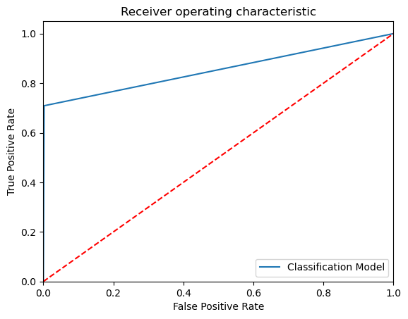

```python
# Importing the libraries 

import pandas as pd
import numpy as np 
import matplotlib.pyplot as plt

# Ignore harmless warnings 

import warnings 
warnings.filterwarnings("ignore")

# Set to display all the columns in dataset

pd.set_option("display.max_columns", None)


```


```python
dtrain=pd.read_csv("/Users/rohit/Downloads/credit card fraud/fraudTrain.csv")
dtest=pd.read_csv("/Users/rohit/Downloads/credit card fraud/fraudTest.csv")
```


```python
dtrain.info()
```

    <class 'pandas.core.frame.DataFrame'>
    RangeIndex: 1296675 entries, 0 to 1296674
    Data columns (total 23 columns):
     #   Column                 Non-Null Count    Dtype  
    ---  ------                 --------------    -----  
     0   Unnamed: 0             1296675 non-null  int64  
     1   trans_date_trans_time  1296675 non-null  object 
     2   cc_num                 1296675 non-null  int64  
     3   merchant               1296675 non-null  object 
     4   category               1296675 non-null  object 
     5   amt                    1296675 non-null  float64
     6   first                  1296675 non-null  object 
     7   last                   1296675 non-null  object 
     8   gender                 1296675 non-null  object 
     9   street                 1296675 non-null  object 
     10  city                   1296675 non-null  object 
     11  state                  1296675 non-null  object 
     12  zip                    1296675 non-null  int64  
     13  lat                    1296675 non-null  float64
     14  long                   1296675 non-null  float64
     15  city_pop               1296675 non-null  int64  
     16  job                    1296675 non-null  object 
     17  dob                    1296675 non-null  object 
     18  trans_num              1296675 non-null  object 
     19  unix_time              1296675 non-null  int64  
     20  merch_lat              1296675 non-null  float64
     21  merch_long             1296675 non-null  float64
     22  is_fraud               1296675 non-null  int64  
    dtypes: float64(5), int64(6), object(12)
    memory usage: 227.5+ MB


```python
dtrain.duplicated().any()
```


    False


```python
dtrain.isnull().sum()
```


    Unnamed: 0               0
    trans_date_trans_time    0
    cc_num                   0
    merchant                 0
    category                 0
    amt                      0
    first                    0
    last                     0
    gender                   0
    street                   0
    city                     0
    state                    0
    zip                      0
    lat                      0
    long                     0
    city_pop                 0
    job                      0
    dob                      0
    trans_num                0
    unix_time                0
    merch_lat                0
    merch_long               0
    is_fraud                 0
    dtype: int64


```python
dtest.duplicated().sum()
```


    0


```python
dtest.isnull().sum()
```


    Unnamed: 0               0
    trans_date_trans_time    0
    cc_num                   0
    merchant                 0
    category                 0
    amt                      0
    first                    0
    last                     0
    gender                   0
    street                   0
    city                     0
    state                    0
    zip                      0
    lat                      0
    long                     0
    city_pop                 0
    job                      0
    dob                      0
    trans_num                0
    unix_time                0
    merch_lat                0
    merch_long               0
    is_fraud                 0
    dtype: int64


```python
from sklearn.preprocessing import LabelEncoder

LE = LabelEncoder()

for col in dtrain.columns:
    if dtrain[col].dtypes=='object':
        dtrain[col]=LE.fit_transform(dtrain[col])
```


```python
dtrain.info()
```

    <class 'pandas.core.frame.DataFrame'>
    RangeIndex: 1296675 entries, 0 to 1296674
    Data columns (total 23 columns):
     #   Column                 Non-Null Count    Dtype  
    ---  ------                 --------------    -----  
     0   Unnamed: 0             1296675 non-null  int64  
     1   trans_date_trans_time  1296675 non-null  int64  
     2   cc_num                 1296675 non-null  int64  
     3   merchant               1296675 non-null  int64  
     4   category               1296675 non-null  int64  
     5   amt                    1296675 non-null  float64
     6   first                  1296675 non-null  int64  
     7   last                   1296675 non-null  int64  
     8   gender                 1296675 non-null  int64  
     9   street                 1296675 non-null  int64  
     10  city                   1296675 non-null  int64  
     11  state                  1296675 non-null  int64  
     12  zip                    1296675 non-null  int64  
     13  lat                    1296675 non-null  float64
     14  long                   1296675 non-null  float64
     15  city_pop               1296675 non-null  int64  
     16  job                    1296675 non-null  int64  
     17  dob                    1296675 non-null  int64  
     18  trans_num              1296675 non-null  int64  
     19  unix_time              1296675 non-null  int64  
     20  merch_lat              1296675 non-null  float64
     21  merch_long             1296675 non-null  float64
     22  is_fraud               1296675 non-null  int64  
    dtypes: float64(5), int64(18)
    memory usage: 227.5 MB


```python
IndepVar = []
for col in dtrain.columns:
    if col != 'is_fraud':
        IndepVar.append(col)

TargetVar = 'is_fraud'

x = dtrain[IndepVar]
y = dtrain[TargetVar]
```


```python
from sklearn.model_selection import train_test_split

x_train, x_test, y_train, y_test = train_test_split(x, y, test_size = 0.30, random_state = 42)

# Display the shape of train and test data 

x_train.shape, x_test.shape, y_train.shape, y_test.shape
```


    ((907672, 22), (389003, 22), (907672,), (389003,))


```python
EMResults = pd.read_csv(r'/Users/rohit/Downloads/EMResults-2.csv')
```


```python
# Build the Calssification models and compare the results

#from sklearn.linear_model import LogisticRegression
from sklearn.tree import DecisionTreeClassifier
from sklearn.ensemble import RandomForestClassifier
from sklearn.naive_bayes import GaussianNB
#from sklearn.svm import SVC
from sklearn.ensemble import ExtraTreesClassifier
from sklearn.neighbors import KNeighborsClassifier
from sklearn.naive_bayes import GaussianNB
#from xgboost import XGBClassifier
#from sklearn import lightgbm as lgb

# Create objects of classification algorithm with default hyper-parameters

#ModelLR = LogisticRegression()
ModelDC = DecisionTreeClassifier()
ModelRF = RandomForestClassifier()
ModelET = ExtraTreesClassifier()
ModelKNN = KNeighborsClassifier(n_neighbors=5)
ModelGNB = GaussianNB()
#ModelSVM = SVC(probability=True)
#ModelXGB = XGBClassifier(n_estimators=100, max_depth=3, eval_metric='mlogloss')
#ModelLGB = lgb.LGBMClassifier()

# Evalution matrix for all the algorithms

#MM = [ModelLR, ModelDC, ModelRF, ModelKNN, ModelGNB, ModelSVM, modelXGB, modelLGB]
MM = [ModelDC, ModelRF, ModelGNB, ModelKNN, ModelDC]

for models in MM:
    
    # Fit the modeltrain data
    
    models.fit(x_train, y_train)
    
    # Prediction the model with test data 
    
    y_pred = models.predict(x_test)
    y_pred_prob = models.predict_proba(x_test)
    
    # Print the model name
    
    print('Model Name: ', models)
    
    # confusion matrix in sklearn

    from sklearn.metrics import confusion_matrix
    from sklearn.metrics import classification_report

    # actual values

    actual = y_test

    # predicted values

    predicted = y_pred

    # confusion matrix

    matrix = confusion_matrix(actual,predicted, labels=[1,0],sample_weight=None, normalize=None)
    print('Confusion matrix : \n', matrix)

    # outcome values order in sklearn

    tp, fn, fp, tn = confusion_matrix(actual,predicted,labels=[1,0]).reshape(-1)
    print('Outcome values : \n', tp, fn, fp, tn)

    # classification report for precision, recall f1-score and accuracy

    C_Report = classification_report(actual,predicted,labels=[1,0])

    print('Classification report : \n', C_Report)

    # calculating the metrics

    sensitivity = round(tp/(tp+fn), 3);
    specificity = round(tn/(tn+fp), 3);
    accuracy = round((tp+tn)/(tp+fp+tn+fn), 3);
    balanced_accuracy = round((sensitivity+specificity)/2, 3);
    
    precision = round(tp/(tp+fp), 3);
    f1Score = round((2*tp/(2*tp + fp + fn)), 3);

    # Matthews Correlation Coefficient (MCC). Range of values of MCC lie between -1 to +1. 
    # A model with a score of +1 is a perfect model and -1 is a poor model

    from math import sqrt

    mx = (tp+fp) * (tp+fn) * (tn+fp) * (tn+fn)
    MCC = round(((tp * tn) - (fp * fn)) / sqrt(mx), 3)

    print('Accuracy :', round(accuracy*100, 2),'%')
    print('Precision :', round(precision*100, 2),'%')
    print('Recall :', round(sensitivity*100,2), '%')
    print('F1 Score :', f1Score)
    print('Specificity or True Negative Rate :', round(specificity*100,2), '%'  )
    print('Balanced Accuracy :', round(balanced_accuracy*100, 2),'%')
    print('MCC :', MCC)

    # Area under ROC curve 

    from sklearn.metrics import roc_curve, roc_auc_score

    print('roc_auc_score:', round(roc_auc_score(actual, predicted), 3))
    
    # ROC Curve
    
    from sklearn.metrics import roc_auc_score
    from sklearn.metrics import roc_curve
    model_roc_auc = roc_auc_score(actual, predicted)
    fpr, tpr, thresholds = roc_curve(actual, models.predict_proba(x_test)[:,1])
    plt.figure()
    # plt.plot(fpr, tpr, label='Logistic Regression (area = %0.2f)' % logit_roc_auc)
    plt.plot(fpr, tpr, label= 'Classification Model' % model_roc_auc)
    plt.plot([0, 1], [0, 1],'r--')
    plt.xlim([0.0, 1.0])
    plt.ylim([0.0, 1.05])
    plt.xlabel('False Positive Rate')
    plt.ylabel('True Positive Rate')
    plt.title('Receiver operating characteristic')
    plt.legend(loc="lower right")
    plt.savefig('Log_ROC')
    plt.show()
    print('-----------------------------------------------------------------------------------------------------')
    #---
    new_row = {'Model Name' : models,
               'True_Positive' : tp, 
               'False_Negative' : fn, 
               'False_Positive' : fp,
               'True_Negative' : tn,
               'Accuracy' : accuracy,
               'Precision' : precision,
               'Recall' : sensitivity,
               'F1 Score' : f1Score,
               'Specificity' : specificity,
               'MCC':MCC,
               'ROC_AUC_Score':roc_auc_score(actual, predicted),
               'Balanced Accuracy':balanced_accuracy}
    EMResults = EMResults.append(new_row, ignore_index=True)
    #---
```

    Model Name:  DecisionTreeClassifier()
    Confusion matrix : 
     [[  1620    665]
     [   821 385897]]
    Outcome values : 
     1620 665 821 385897
    Classification report : 
                   precision    recall  f1-score   support
    
               1       0.66      0.71      0.69      2285
               0       1.00      1.00      1.00    386718
    
        accuracy                           1.00    389003
       macro avg       0.83      0.85      0.84    389003
    weighted avg       1.00      1.00      1.00    389003
    
    Accuracy : 99.6 %
    Precision : 66.4 %
    Recall : 70.9 %
    F1 Score : 0.686
    Specificity or True Negative Rate : 99.8 %
    Balanced Accuracy : 85.3 %
    MCC : 0.684
    roc_auc_score: 0.853


    

    


    -----------------------------------------------------------------------------------------------------
    Model Name:  RandomForestClassifier()
    Confusion matrix : 
     [[  1515    770]
     [   120 386598]]
    Outcome values : 
     1515 770 120 386598
    Classification report : 
                   precision    recall  f1-score   support
    
               1       0.93      0.66      0.77      2285
               0       1.00      1.00      1.00    386718
    
        accuracy                           1.00    389003
       macro avg       0.96      0.83      0.89    389003
    weighted avg       1.00      1.00      1.00    389003
    
    Accuracy : 99.8 %
    Precision : 92.7 %
    Recall : 66.3 %
    F1 Score : 0.773
    Specificity or True Negative Rate : 100.0 %
    Balanced Accuracy : 83.2 %
    MCC : 0.783
    roc_auc_score: 0.831


    

    


    -----------------------------------------------------------------------------------------------------
    Model Name:  GaussianNB()
    Confusion matrix : 
     [[     0   2285]
     [     0 386718]]
    Outcome values : 
     0 2285 0 386718
    Classification report : 
                   precision    recall  f1-score   support
    
               1       0.00      0.00      0.00      2285
               0       0.99      1.00      1.00    386718
    
        accuracy                           0.99    389003
       macro avg       0.50      0.50      0.50    389003
    weighted avg       0.99      0.99      0.99    389003
    
    Accuracy : 99.4 %
    Precision : nan %
    Recall : 0.0 %
    F1 Score : 0.0
    Specificity or True Negative Rate : 100.0 %
    Balanced Accuracy : 50.0 %
    MCC : nan
    roc_auc_score: 0.5


    

    


    -----------------------------------------------------------------------------------------------------
    Model Name:  KNeighborsClassifier()
    Confusion matrix : 
     [[   462   1823]
     [   225 386493]]
    Outcome values : 
     462 1823 225 386493
    Classification report : 
                   precision    recall  f1-score   support
    
               1       0.67      0.20      0.31      2285
               0       1.00      1.00      1.00    386718
    
        accuracy                           0.99    389003
       macro avg       0.83      0.60      0.65    389003
    weighted avg       0.99      0.99      0.99    389003
    
    Accuracy : 99.5 %
    Precision : 67.2 %
    Recall : 20.2 %
    F1 Score : 0.311
    Specificity or True Negative Rate : 99.9 %
    Balanced Accuracy : 60.0 %
    MCC : 0.367
    roc_auc_score: 0.601


    

    


    -----------------------------------------------------------------------------------------------------
    Model Name:  DecisionTreeClassifier()
    Confusion matrix : 
     [[  1608    677]
     [   802 385916]]
    Outcome values : 
     1608 677 802 385916
    Classification report : 
                   precision    recall  f1-score   support
    
               1       0.67      0.70      0.68      2285
               0       1.00      1.00      1.00    386718
    
        accuracy                           1.00    389003
       macro avg       0.83      0.85      0.84    389003
    weighted avg       1.00      1.00      1.00    389003
    
    Accuracy : 99.6 %
    Precision : 66.7 %
    Recall : 70.4 %
    F1 Score : 0.685
    Specificity or True Negative Rate : 99.8 %
    Balanced Accuracy : 85.1 %
    MCC : 0.683
    roc_auc_score: 0.851


    

    


    -----------------------------------------------------------------------------------------------------


```python
#Results
EMResults
```


<div>
<style scoped>
    .dataframe tbody tr th:only-of-type {
        vertical-align: middle;
    }

    .dataframe tbody tr th {
        vertical-align: top;
    }

    .dataframe thead th {
        text-align: right;
    }
</style>
<table border="1" class="dataframe">
  <thead>
    <tr style="text-align: right;">
      <th></th>
      <th>Model Name</th>
      <th>True_Positive</th>
      <th>False_Negative</th>
      <th>False_Positive</th>
      <th>True_Negative</th>
      <th>Accuracy</th>
      <th>Precision</th>
      <th>Recall</th>
      <th>F1 Score</th>
      <th>Specificity</th>
      <th>MCC</th>
      <th>ROC_AUC_Score</th>
      <th>Balanced Accuracy</th>
    </tr>
  </thead>
  <tbody>
    <tr>
      <th>0</th>
      <td>DecisionTreeClassifier()</td>
      <td>1620</td>
      <td>665</td>
      <td>821</td>
      <td>385897</td>
      <td>0.996</td>
      <td>0.664</td>
      <td>0.709</td>
      <td>0.686</td>
      <td>0.998</td>
      <td>0.684</td>
      <td>0.853424</td>
      <td>0.853</td>
    </tr>
    <tr>
      <th>1</th>
      <td>(DecisionTreeClassifier(max_features='sqrt', r...</td>
      <td>1515</td>
      <td>770</td>
      <td>120</td>
      <td>386598</td>
      <td>0.998</td>
      <td>0.927</td>
      <td>0.663</td>
      <td>0.773</td>
      <td>1.000</td>
      <td>0.783</td>
      <td>0.831355</td>
      <td>0.832</td>
    </tr>
    <tr>
      <th>2</th>
      <td>GaussianNB()</td>
      <td>0</td>
      <td>2285</td>
      <td>0</td>
      <td>386718</td>
      <td>0.994</td>
      <td>NaN</td>
      <td>0.000</td>
      <td>0.000</td>
      <td>1.000</td>
      <td>NaN</td>
      <td>0.500000</td>
      <td>0.500</td>
    </tr>
    <tr>
      <th>3</th>
      <td>KNeighborsClassifier()</td>
      <td>462</td>
      <td>1823</td>
      <td>225</td>
      <td>386493</td>
      <td>0.995</td>
      <td>0.672</td>
      <td>0.202</td>
      <td>0.311</td>
      <td>0.999</td>
      <td>0.367</td>
      <td>0.600803</td>
      <td>0.600</td>
    </tr>
    <tr>
      <th>4</th>
      <td>DecisionTreeClassifier()</td>
      <td>1608</td>
      <td>677</td>
      <td>802</td>
      <td>385916</td>
      <td>0.996</td>
      <td>0.667</td>
      <td>0.704</td>
      <td>0.685</td>
      <td>0.998</td>
      <td>0.683</td>
      <td>0.850823</td>
      <td>0.851</td>
    </tr>
  </tbody>
</table>
</div>


```python
Results = pd.DataFrame({'target_A':y_test, 'target_P':y_pred})
ResultsFinal = dtrain.merge(Results, left_index=True, right_index=True)
ResultsFinal
```


<div>
<style scoped>
    .dataframe tbody tr th:only-of-type {
        vertical-align: middle;
    }

    .dataframe tbody tr th {
        vertical-align: top;
    }

    .dataframe thead th {
        text-align: right;
    }
</style>
<table border="1" class="dataframe">
  <thead>
    <tr style="text-align: right;">
      <th></th>
      <th>Unnamed: 0</th>
      <th>trans_date_trans_time</th>
      <th>cc_num</th>
      <th>merchant</th>
      <th>category</th>
      <th>amt</th>
      <th>first</th>
      <th>last</th>
      <th>gender</th>
      <th>street</th>
      <th>city</th>
      <th>state</th>
      <th>zip</th>
      <th>lat</th>
      <th>long</th>
      <th>city_pop</th>
      <th>job</th>
      <th>dob</th>
      <th>trans_num</th>
      <th>unix_time</th>
      <th>merch_lat</th>
      <th>merch_long</th>
      <th>is_fraud</th>
      <th>target_A</th>
      <th>target_P</th>
    </tr>
  </thead>
  <tbody>
    <tr>
      <th>0</th>
      <td>0</td>
      <td>0</td>
      <td>2703186189652095</td>
      <td>514</td>
      <td>8</td>
      <td>4.97</td>
      <td>162</td>
      <td>18</td>
      <td>0</td>
      <td>568</td>
      <td>526</td>
      <td>27</td>
      <td>28654</td>
      <td>36.0788</td>
      <td>-81.1781</td>
      <td>3495</td>
      <td>370</td>
      <td>779</td>
      <td>56438</td>
      <td>1325376018</td>
      <td>36.011293</td>
      <td>-82.048315</td>
      <td>0</td>
      <td>0</td>
      <td>0</td>
    </tr>
    <tr>
      <th>2</th>
      <td>2</td>
      <td>2</td>
      <td>38859492057661</td>
      <td>390</td>
      <td>0</td>
      <td>220.11</td>
      <td>115</td>
      <td>381</td>
      <td>1</td>
      <td>602</td>
      <td>468</td>
      <td>13</td>
      <td>83252</td>
      <td>42.1808</td>
      <td>-112.2620</td>
      <td>4154</td>
      <td>307</td>
      <td>302</td>
      <td>818703</td>
      <td>1325376051</td>
      <td>43.150704</td>
      <td>-112.154481</td>
      <td>0</td>
      <td>0</td>
      <td>0</td>
    </tr>
    <tr>
      <th>5</th>
      <td>5</td>
      <td>5</td>
      <td>4767265376804500</td>
      <td>607</td>
      <td>2</td>
      <td>94.63</td>
      <td>162</td>
      <td>82</td>
      <td>0</td>
      <td>471</td>
      <td>223</td>
      <td>38</td>
      <td>18917</td>
      <td>40.3750</td>
      <td>-75.2045</td>
      <td>2158</td>
      <td>479</td>
      <td>290</td>
      <td>124696</td>
      <td>1325376248</td>
      <td>40.653382</td>
      <td>-76.152667</td>
      <td>0</td>
      <td>0</td>
      <td>0</td>
    </tr>
    <tr>
      <th>7</th>
      <td>7</td>
      <td>7</td>
      <td>6011360759745864</td>
      <td>107</td>
      <td>2</td>
      <td>71.65</td>
      <td>311</td>
      <td>467</td>
      <td>1</td>
      <td>224</td>
      <td>236</td>
      <td>45</td>
      <td>22824</td>
      <td>38.8432</td>
      <td>-78.6003</td>
      <td>6018</td>
      <td>127</td>
      <td>122</td>
      <td>552855</td>
      <td>1325376308</td>
      <td>38.948089</td>
      <td>-78.540296</td>
      <td>0</td>
      <td>0</td>
      <td>0</td>
    </tr>
    <tr>
      <th>12</th>
      <td>12</td>
      <td>12</td>
      <td>180042946491150</td>
      <td>394</td>
      <td>4</td>
      <td>71.22</td>
      <td>66</td>
      <td>368</td>
      <td>1</td>
      <td>347</td>
      <td>723</td>
      <td>9</td>
      <td>33710</td>
      <td>27.7898</td>
      <td>-82.7243</td>
      <td>341043</td>
      <td>165</td>
      <td>794</td>
      <td>981946</td>
      <td>1325376416</td>
      <td>27.630593</td>
      <td>-82.308891</td>
      <td>0</td>
      <td>0</td>
      <td>0</td>
    </tr>
    <tr>
      <th>...</th>
      <td>...</td>
      <td>...</td>
      <td>...</td>
      <td>...</td>
      <td>...</td>
      <td>...</td>
      <td>...</td>
      <td>...</td>
      <td>...</td>
      <td>...</td>
      <td>...</td>
      <td>...</td>
      <td>...</td>
      <td>...</td>
      <td>...</td>
      <td>...</td>
      <td>...</td>
      <td>...</td>
      <td>...</td>
      <td>...</td>
      <td>...</td>
      <td>...</td>
      <td>...</td>
      <td>...</td>
      <td>...</td>
    </tr>
    <tr>
      <th>1296665</th>
      <td>1296665</td>
      <td>1274781</td>
      <td>213193596103206</td>
      <td>211</td>
      <td>6</td>
      <td>72.17</td>
      <td>152</td>
      <td>207</td>
      <td>1</td>
      <td>737</td>
      <td>651</td>
      <td>22</td>
      <td>49775</td>
      <td>45.7549</td>
      <td>-84.4470</td>
      <td>95</td>
      <td>147</td>
      <td>875</td>
      <td>84021</td>
      <td>1371816522</td>
      <td>44.938461</td>
      <td>-83.996234</td>
      <td>0</td>
      <td>0</td>
      <td>0</td>
    </tr>
    <tr>
      <th>1296666</th>
      <td>1296666</td>
      <td>1274782</td>
      <td>4587657402165341815</td>
      <td>274</td>
      <td>5</td>
      <td>7.30</td>
      <td>11</td>
      <td>245</td>
      <td>0</td>
      <td>635</td>
      <td>638</td>
      <td>14</td>
      <td>60958</td>
      <td>41.0646</td>
      <td>-87.5917</td>
      <td>2135</td>
      <td>374</td>
      <td>964</td>
      <td>281762</td>
      <td>1371816562</td>
      <td>40.556811</td>
      <td>-88.092339</td>
      <td>0</td>
      <td>0</td>
      <td>0</td>
    </tr>
    <tr>
      <th>1296668</th>
      <td>1296668</td>
      <td>1274784</td>
      <td>213141712584544</td>
      <td>424</td>
      <td>7</td>
      <td>100.85</td>
      <td>225</td>
      <td>94</td>
      <td>0</td>
      <td>744</td>
      <td>268</td>
      <td>25</td>
      <td>39073</td>
      <td>32.1530</td>
      <td>-90.1217</td>
      <td>19685</td>
      <td>196</td>
      <td>708</td>
      <td>68597</td>
      <td>1371816683</td>
      <td>31.377697</td>
      <td>-90.528450</td>
      <td>0</td>
      <td>0</td>
      <td>0</td>
    </tr>
    <tr>
      <th>1296672</th>
      <td>1296672</td>
      <td>1274788</td>
      <td>3514865930894695</td>
      <td>599</td>
      <td>1</td>
      <td>105.93</td>
      <td>74</td>
      <td>67</td>
      <td>1</td>
      <td>158</td>
      <td>346</td>
      <td>32</td>
      <td>88325</td>
      <td>32.9396</td>
      <td>-105.8189</td>
      <td>899</td>
      <td>308</td>
      <td>412</td>
      <td>366013</td>
      <td>1371816752</td>
      <td>33.619513</td>
      <td>-105.130529</td>
      <td>0</td>
      <td>0</td>
      <td>0</td>
    </tr>
    <tr>
      <th>1296673</th>
      <td>1296673</td>
      <td>1274789</td>
      <td>2720012583106919</td>
      <td>509</td>
      <td>1</td>
      <td>74.90</td>
      <td>179</td>
      <td>304</td>
      <td>1</td>
      <td>433</td>
      <td>471</td>
      <td>41</td>
      <td>57756</td>
      <td>43.3526</td>
      <td>-102.5411</td>
      <td>1126</td>
      <td>485</td>
      <td>639</td>
      <td>1086299</td>
      <td>1371816816</td>
      <td>42.788940</td>
      <td>-103.241160</td>
      <td>0</td>
      <td>0</td>
      <td>0</td>
    </tr>
  </tbody>
</table>
<p>389003 rows × 25 columns</p>
</div>


```python
#CROSS VALIDATION
from sklearn.model_selection import cross_val_score, train_test_split
from sklearn.ensemble import RandomForestClassifier  # Replace with your chosen model
from sklearn.metrics import accuracy_score


# Split the data into training and testing sets
X_train, X_test, y_train, y_test = train_test_split(x, y, test_size=0.2, random_state=42)

# Choose your machine learning model
model = RandomForestClassifier()  # Replace with your chosen model

# Perform k-fold cross-validation on the training data
# Here, we use 5-fold cross-validation as an example
cv_scores = cross_val_score(model, X_train, y_train, cv=5)

# Print the cross-validation scores
print("Cross-Validation Scores:", cv_scores)
print("Mean CV Score:", cv_scores.mean())

# Fit the model on the entire training data
model.fit(X_train, y_train)

# Make predictions on the test set
y_pred = model.predict(X_test)

# Evaluate the model on the test set
accuracy = accuracy_score(y_test, y_pred)
print("Test Accuracy:", accuracy)

```

    Cross-Validation Scores: [0.99769121 0.99746467 0.99757553 0.99755625 0.99762373]
    Mean CV Score: 0.9975822777488578
    Test Accuracy: 0.9977673665336341


```python

```
