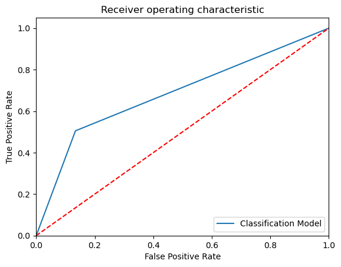
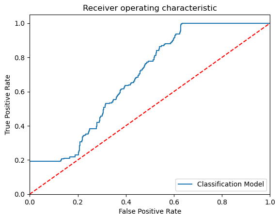
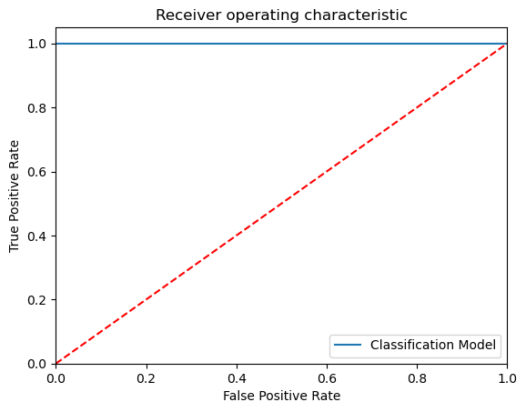

```python
# Importing the libraries 

import pandas as pd
import numpy as np 
import matplotlib.pyplot as plt

# Ignore harmless warnings 

import warnings 
warnings.filterwarnings("ignore")

# Set to display all the columns in dataset

pd.set_option("display.max_columns", None)


```


```python
dt=pd.read_csv(r'/Users/rohit/Downloads/spam.xlsx', encoding='latin-1')
```


```python
dt.shape
```


    (5572, 5)


```python
dt.columns

```


    Index(['v1', 'v2', 'Unnamed: 2', 'Unnamed: 3', 'Unnamed: 4'], dtype='object')


```python
dt.head
```


    <bound method NDFrame.head of         v1                                                 v2 Unnamed: 2  \
    0      ham  Go until jurong point, crazy.. Available only ...        NaN   
    1      ham                      Ok lar... Joking wif u oni...        NaN   
    2     spam  Free entry in 2 a wkly comp to win FA Cup fina...        NaN   
    3      ham  U dun say so early hor... U c already then say...        NaN   
    4      ham  Nah I don't think he goes to usf, he lives aro...        NaN   
    ...    ...                                                ...        ...   
    5567  spam  This is the 2nd time we have tried 2 contact u...        NaN   
    5568   ham              Will Ì_ b going to esplanade fr home?        NaN   
    5569   ham  Pity, * was in mood for that. So...any other s...        NaN   
    5570   ham  The guy did some bitching but I acted like i'd...        NaN   
    5571   ham                         Rofl. Its true to its name        NaN   
    
         Unnamed: 3 Unnamed: 4  
    0           NaN        NaN  
    1           NaN        NaN  
    2           NaN        NaN  
    3           NaN        NaN  
    4           NaN        NaN  
    ...         ...        ...  
    5567        NaN        NaN  
    5568        NaN        NaN  
    5569        NaN        NaN  
    5570        NaN        NaN  
    5571        NaN        NaN  
    
    [5572 rows x 5 columns]>


```python
dt.isnull().sum()
```


    v1               0
    v2               0
    Unnamed: 2    5522
    Unnamed: 3    5560
    Unnamed: 4    5566
    dtype: int64


```python
# Using KNN Imputer to address the Driver_Age missing values

 #KNNImputer(missing_values=np.nan, n_neighbors=5, weights='uniform', metric='nan_euclidean', 
 #copy=True, add_indicator=False)

from sklearn.impute import KNNImputer

imputer_knn = KNNImputer(missing_values=np.nan)


dt['Unnamed: 2'] = imputer_knn.fit_transform(dt[['Unnamed: 2']])

dt['Unnamed: 3'] = dt['Unnamed: 3'].astype(int)

dt['Unnamed: 4'] = dt['Unnamed: 4'].astype(int)

dt
```


<div>
<style scoped>
    .dataframe tbody tr th:only-of-type {
        vertical-align: middle;
    }

    .dataframe tbody tr th {
        vertical-align: top;
    }

    .dataframe thead th {
        text-align: right;
    }
</style>
<table border="1" class="dataframe">
  <thead>
    <tr style="text-align: right;">
      <th></th>
      <th>v1</th>
      <th>v2</th>
      <th>Unnamed: 2</th>
      <th>Unnamed: 3</th>
      <th>Unnamed: 4</th>
    </tr>
  </thead>
  <tbody>
    <tr>
      <th>0</th>
      <td>0</td>
      <td>1079</td>
      <td>43.0</td>
      <td>10</td>
      <td>5</td>
    </tr>
    <tr>
      <th>1</th>
      <td>0</td>
      <td>3101</td>
      <td>43.0</td>
      <td>10</td>
      <td>5</td>
    </tr>
    <tr>
      <th>2</th>
      <td>1</td>
      <td>1000</td>
      <td>43.0</td>
      <td>10</td>
      <td>5</td>
    </tr>
    <tr>
      <th>3</th>
      <td>0</td>
      <td>4088</td>
      <td>43.0</td>
      <td>10</td>
      <td>5</td>
    </tr>
    <tr>
      <th>4</th>
      <td>0</td>
      <td>2757</td>
      <td>43.0</td>
      <td>10</td>
      <td>5</td>
    </tr>
    <tr>
      <th>...</th>
      <td>...</td>
      <td>...</td>
      <td>...</td>
      <td>...</td>
      <td>...</td>
    </tr>
    <tr>
      <th>5567</th>
      <td>1</td>
      <td>3992</td>
      <td>43.0</td>
      <td>10</td>
      <td>5</td>
    </tr>
    <tr>
      <th>5568</th>
      <td>0</td>
      <td>4560</td>
      <td>43.0</td>
      <td>10</td>
      <td>5</td>
    </tr>
    <tr>
      <th>5569</th>
      <td>0</td>
      <td>3286</td>
      <td>43.0</td>
      <td>10</td>
      <td>5</td>
    </tr>
    <tr>
      <th>5570</th>
      <td>0</td>
      <td>3901</td>
      <td>43.0</td>
      <td>10</td>
      <td>5</td>
    </tr>
    <tr>
      <th>5571</th>
      <td>0</td>
      <td>3409</td>
      <td>43.0</td>
      <td>10</td>
      <td>5</td>
    </tr>
  </tbody>
</table>
<p>5572 rows × 5 columns</p>
</div>


```python
dt.duplicated().any()
```


    True


```python
dt.drop_duplicates()
```


<div>
<style scoped>
    .dataframe tbody tr th:only-of-type {
        vertical-align: middle;
    }

    .dataframe tbody tr th {
        vertical-align: top;
    }

    .dataframe thead th {
        text-align: right;
    }
</style>
<table border="1" class="dataframe">
  <thead>
    <tr style="text-align: right;">
      <th></th>
      <th>v1</th>
      <th>v2</th>
      <th>Unnamed: 2</th>
      <th>Unnamed: 3</th>
      <th>Unnamed: 4</th>
    </tr>
  </thead>
  <tbody>
    <tr>
      <th>0</th>
      <td>0</td>
      <td>1079</td>
      <td>43.0</td>
      <td>10</td>
      <td>5</td>
    </tr>
    <tr>
      <th>1</th>
      <td>0</td>
      <td>3101</td>
      <td>43.0</td>
      <td>10</td>
      <td>5</td>
    </tr>
    <tr>
      <th>2</th>
      <td>1</td>
      <td>1000</td>
      <td>43.0</td>
      <td>10</td>
      <td>5</td>
    </tr>
    <tr>
      <th>3</th>
      <td>0</td>
      <td>4088</td>
      <td>43.0</td>
      <td>10</td>
      <td>5</td>
    </tr>
    <tr>
      <th>4</th>
      <td>0</td>
      <td>2757</td>
      <td>43.0</td>
      <td>10</td>
      <td>5</td>
    </tr>
    <tr>
      <th>...</th>
      <td>...</td>
      <td>...</td>
      <td>...</td>
      <td>...</td>
      <td>...</td>
    </tr>
    <tr>
      <th>5567</th>
      <td>1</td>
      <td>3992</td>
      <td>43.0</td>
      <td>10</td>
      <td>5</td>
    </tr>
    <tr>
      <th>5568</th>
      <td>0</td>
      <td>4560</td>
      <td>43.0</td>
      <td>10</td>
      <td>5</td>
    </tr>
    <tr>
      <th>5569</th>
      <td>0</td>
      <td>3286</td>
      <td>43.0</td>
      <td>10</td>
      <td>5</td>
    </tr>
    <tr>
      <th>5570</th>
      <td>0</td>
      <td>3901</td>
      <td>43.0</td>
      <td>10</td>
      <td>5</td>
    </tr>
    <tr>
      <th>5571</th>
      <td>0</td>
      <td>3409</td>
      <td>43.0</td>
      <td>10</td>
      <td>5</td>
    </tr>
  </tbody>
</table>
<p>5169 rows × 5 columns</p>
</div>


```python
dt.info()
```

    <class 'pandas.core.frame.DataFrame'>
    RangeIndex: 5572 entries, 0 to 5571
    Data columns (total 5 columns):
     #   Column      Non-Null Count  Dtype  
    ---  ------      --------------  -----  
     0   v1          5572 non-null   int64  
     1   v2          5572 non-null   int64  
     2   Unnamed: 2  5572 non-null   float64
     3   Unnamed: 3  5572 non-null   int64  
     4   Unnamed: 4  5572 non-null   int64  
    dtypes: float64(1), int64(4)
    memory usage: 217.8 KB


```python
# Identify the Independent and Target variables

IndepVar = ['v1']
for col in dt.columns:
    if col != '':
        IndepVar.append(col)

TargetVar = 'v1'

x = dt[IndepVar]
y = dt[TargetVar]
```


```python
# Splitting the dataset into train and test 

from sklearn.model_selection import train_test_split

x_train, x_test, y_train, y_test = train_test_split(x, y, test_size = 0.30, random_state = 42)

# Display the shape of train and test data 

x_train.shape, x_test.shape, y_train.shape, y_test.shape
```


    ((3900, 6), (1672, 6), (3900,), (1672,))


```python
EMResults = pd.read_csv(r'/Users/rohit/Downloads/EMResults-2.csv')
```


```python
# Build the Calssification models and compare the results

from sklearn.linear_model import LogisticRegression
#from sklearn.tree import DecisionTreeClassifier
#from sklearn.ensemble import RandomForestClassifier
#from sklearn.naive_bayes import GaussianNB
from sklearn.svm import SVC
from sklearn.ensemble import ExtraTreesClassifier
from sklearn.neighbors import KNeighborsClassifier
#from sklearn.naive_bayes import GaussianNB
#from xgboost import XGBClassifier
#from sklearn import lightgbm as lgb

# Create objects of classification algorithm with default hyper-parameters

ModelLR = LogisticRegression()
#ModelDC = DecisionTreeClassifier()
#ModelRF = RandomForestClassifier()
ModelET = ExtraTreesClassifier()
ModelKNN = KNeighborsClassifier(n_neighbors=5)
#ModelGNB = GaussianNB()
ModelSVM = SVC(probability=True)
#ModelXGB = XGBClassifier(n_estimators=100, max_depth=3, eval_metric='mlogloss')
#ModelLGB = lgb.LGBMClassifier()

# Evalution matrix for all the algorithms

#MM = [ModelLR, ModelDC, ModelRF, ModelKNN, ModelGNB, ModelSVM, modelXGB, modelLGB]
MM = [ModelKNN, ModelSVM,ModelLR]

for models in MM:
    
    # Fit the modeltrain data
    
    models.fit(x_train, y_train)
    
    # Prediction the model with test data 
    
    y_pred = models.predict(x_test)
    y_pred_prob = models.predict_proba(x_test)
    
    # Print the model name
    
    print('Model Name: ', models)
    
    # confusion matrix in sklearn

    from sklearn.metrics import confusion_matrix
    from sklearn.metrics import classification_report

    # actual values

    actual = y_test

    # predicted values

    predicted = y_pred

    # confusion matrix

    matrix = confusion_matrix(actual,predicted, labels=[1,0],sample_weight=None, normalize=None)
    print('Confusion matrix : \n', matrix)

    # outcome values order in sklearn

    tp, fn, fp, tn = confusion_matrix(actual,predicted,labels=[1,0]).reshape(-1)
    print('Outcome values : \n', tp, fn, fp, tn)

    # classification report for precision, recall f1-score and accuracy

    C_Report = classification_report(actual,predicted,labels=[1,0])

    print('Classification report : \n', C_Report)

    # calculating the metrics

    sensitivity = round(tp/(tp+fn), 3);
    specificity = round(tn/(tn+fp), 3);
    accuracy = round((tp+tn)/(tp+fp+tn+fn), 3);
    balanced_accuracy = round((sensitivity+specificity)/2, 3);
    
    precision = round(tp/(tp+fp), 3);
    f1Score = round((2*tp/(2*tp + fp + fn)), 3);

    # Matthews Correlation Coefficient (MCC). Range of values of MCC lie between -1 to +1. 
    # A model with a score of +1 is a perfect model and -1 is a poor model

    from math import sqrt

    mx = (tp+fp) * (tp+fn) * (tn+fp) * (tn+fn)
    MCC = round(((tp * tn) - (fp * fn)) / sqrt(mx), 3)

    print('Accuracy :', round(accuracy*100, 2),'%')
    print('Precision :', round(precision*100, 2),'%')
    print('Recall :', round(sensitivity*100,2), '%')
    print('F1 Score :', f1Score)
    print('Specificity or True Negative Rate :', round(specificity*100,2), '%'  )
    print('Balanced Accuracy :', round(balanced_accuracy*100, 2),'%')
    print('MCC :', MCC)

    # Area under ROC curve 

    from sklearn.metrics import roc_curve, roc_auc_score

    print('roc_auc_score:', round(roc_auc_score(actual, predicted), 3))
    
    # ROC Curve
    
    from sklearn.metrics import roc_auc_score
    from sklearn.metrics import roc_curve
    model_roc_auc = roc_auc_score(actual, predicted)
    fpr, tpr, thresholds = roc_curve(actual, models.predict_proba(x_test)[:,1])
    plt.figure()
    # plt.plot(fpr, tpr, label='Logistic Regression (area = %0.2f)' % logit_roc_auc)
    plt.plot(fpr, tpr, label= 'Classification Model' % model_roc_auc)
    plt.plot([0, 1], [0, 1],'r--')
    plt.xlim([0.0, 1.0])
    plt.ylim([0.0, 1.05])
    plt.xlabel('False Positive Rate')
    plt.ylabel('True Positive Rate')
    plt.title('Receiver operating characteristic')
    plt.legend(loc="lower right")
    plt.savefig('Log_ROC')
    plt.show()
    print('-----------------------------------------------------------------------------------------------------')
    #---
    new_row = {'Model Name' : models,
               'True_Positive' : tp, 
               'False_Negative' : fn, 
               'False_Positive' : fp,
               'True_Negative' : tn,
               'Accuracy' : accuracy,
               'Precision' : precision,
               'Recall' : sensitivity,
               'F1 Score' : f1Score,
               'Specificity' : specificity,
               'MCC':MCC,
               'ROC_AUC_Score':roc_auc_score(actual, predicted),
               'Balanced Accuracy':balanced_accuracy}
    EMResults = EMResults.append(new_row, ignore_index=True)
    #---
```

    Model Name:  KNeighborsClassifier()
    Confusion matrix : 
     [[ 127   92]
     [  45 1408]]
    Outcome values : 
     127 92 45 1408
    Classification report : 
                   precision    recall  f1-score   support
    
               1       0.74      0.58      0.65       219
               0       0.94      0.97      0.95      1453
    
        accuracy                           0.92      1672
       macro avg       0.84      0.77      0.80      1672
    weighted avg       0.91      0.92      0.91      1672
    
    Accuracy : 91.8 %
    Precision : 73.8 %
    Recall : 58.0 %
    F1 Score : 0.65
    Specificity or True Negative Rate : 96.9 %
    Balanced Accuracy : 77.4 %
    MCC : 0.61
    roc_auc_score: 0.774


    

    


    -----------------------------------------------------------------------------------------------------
    Model Name:  SVC(probability=True)
    Confusion matrix : 
     [[   0  219]
     [   0 1453]]
    Outcome values : 
     0 219 0 1453
    Classification report : 
                   precision    recall  f1-score   support
    
               1       0.00      0.00      0.00       219
               0       0.87      1.00      0.93      1453
    
        accuracy                           0.87      1672
       macro avg       0.43      0.50      0.46      1672
    weighted avg       0.76      0.87      0.81      1672
    
    Accuracy : 86.9 %
    Precision : nan %
    Recall : 0.0 %
    F1 Score : 0.0
    Specificity or True Negative Rate : 100.0 %
    Balanced Accuracy : 50.0 %
    MCC : nan
    roc_auc_score: 0.5


    

    


    -----------------------------------------------------------------------------------------------------
    Model Name:  LogisticRegression()
    Confusion matrix : 
     [[ 219    0]
     [   0 1453]]
    Outcome values : 
     219 0 0 1453
    Classification report : 
                   precision    recall  f1-score   support
    
               1       1.00      1.00      1.00       219
               0       1.00      1.00      1.00      1453
    
        accuracy                           1.00      1672
       macro avg       1.00      1.00      1.00      1672
    weighted avg       1.00      1.00      1.00      1672
    
    Accuracy : 100.0 %
    Precision : 100.0 %
    Recall : 100.0 %
    F1 Score : 1.0
    Specificity or True Negative Rate : 100.0 %
    Balanced Accuracy : 100.0 %
    MCC : 1.0
    roc_auc_score: 1.0


    

    


    -----------------------------------------------------------------------------------------------------


```python
EMResults.head()
```


<div>
<style scoped>
    .dataframe tbody tr th:only-of-type {
        vertical-align: middle;
    }

    .dataframe tbody tr th {
        vertical-align: top;
    }

    .dataframe thead th {
        text-align: right;
    }
</style>
<table border="1" class="dataframe">
  <thead>
    <tr style="text-align: right;">
      <th></th>
      <th>Model Name</th>
      <th>True_Positive</th>
      <th>False_Negative</th>
      <th>False_Positive</th>
      <th>True_Negative</th>
      <th>Accuracy</th>
      <th>Precision</th>
      <th>Recall</th>
      <th>F1 Score</th>
      <th>Specificity</th>
      <th>MCC</th>
      <th>ROC_AUC_Score</th>
      <th>Balanced Accuracy</th>
    </tr>
  </thead>
  <tbody>
    <tr>
      <th>0</th>
      <td>DecisionTreeClassifier()</td>
      <td>219</td>
      <td>0</td>
      <td>0</td>
      <td>1453</td>
      <td>1.000</td>
      <td>1.000</td>
      <td>1.00</td>
      <td>1.00</td>
      <td>1.000</td>
      <td>1.00</td>
      <td>1.000000</td>
      <td>1.000</td>
    </tr>
    <tr>
      <th>1</th>
      <td>(DecisionTreeClassifier(max_features='sqrt', r...</td>
      <td>219</td>
      <td>0</td>
      <td>0</td>
      <td>1453</td>
      <td>1.000</td>
      <td>1.000</td>
      <td>1.00</td>
      <td>1.00</td>
      <td>1.000</td>
      <td>1.00</td>
      <td>1.000000</td>
      <td>1.000</td>
    </tr>
    <tr>
      <th>2</th>
      <td>GaussianNB()</td>
      <td>219</td>
      <td>0</td>
      <td>0</td>
      <td>1453</td>
      <td>1.000</td>
      <td>1.000</td>
      <td>1.00</td>
      <td>1.00</td>
      <td>1.000</td>
      <td>1.00</td>
      <td>1.000000</td>
      <td>1.000</td>
    </tr>
    <tr>
      <th>3</th>
      <td>KNeighborsClassifier()</td>
      <td>127</td>
      <td>92</td>
      <td>45</td>
      <td>1408</td>
      <td>0.918</td>
      <td>0.738</td>
      <td>0.58</td>
      <td>0.65</td>
      <td>0.969</td>
      <td>0.61</td>
      <td>0.774469</td>
      <td>0.774</td>
    </tr>
    <tr>
      <th>4</th>
      <td>DecisionTreeClassifier()</td>
      <td>219</td>
      <td>0</td>
      <td>0</td>
      <td>1453</td>
      <td>1.000</td>
      <td>1.000</td>
      <td>1.00</td>
      <td>1.00</td>
      <td>1.000</td>
      <td>1.00</td>
      <td>1.000000</td>
      <td>1.000</td>
    </tr>
  </tbody>
</table>
</div>


```python
Results = pd.DataFrame({'target_A':y_test, 'target_P':y_pred})

# Merge two Dataframes on index of both the dataframes

ResultsFinal = dt.merge(Results, left_index=True, right_index=True)
ResultsFinal.head()
```


<div>
<style scoped>
    .dataframe tbody tr th:only-of-type {
        vertical-align: middle;
    }

    .dataframe tbody tr th {
        vertical-align: top;
    }

    .dataframe thead th {
        text-align: right;
    }
</style>
<table border="1" class="dataframe">
  <thead>
    <tr style="text-align: right;">
      <th></th>
      <th>v1</th>
      <th>v2</th>
      <th>Unnamed: 2</th>
      <th>Unnamed: 3</th>
      <th>Unnamed: 4</th>
      <th>target_A</th>
      <th>target_P</th>
    </tr>
  </thead>
  <tbody>
    <tr>
      <th>8</th>
      <td>1</td>
      <td>4249</td>
      <td>43.0</td>
      <td>10</td>
      <td>5</td>
      <td>1</td>
      <td>1</td>
    </tr>
    <tr>
      <th>12</th>
      <td>1</td>
      <td>4145</td>
      <td>43.0</td>
      <td>10</td>
      <td>5</td>
      <td>1</td>
      <td>1</td>
    </tr>
    <tr>
      <th>15</th>
      <td>1</td>
      <td>4590</td>
      <td>43.0</td>
      <td>10</td>
      <td>5</td>
      <td>1</td>
      <td>1</td>
    </tr>
    <tr>
      <th>17</th>
      <td>0</td>
      <td>890</td>
      <td>43.0</td>
      <td>10</td>
      <td>5</td>
      <td>0</td>
      <td>0</td>
    </tr>
    <tr>
      <th>19</th>
      <td>1</td>
      <td>897</td>
      <td>43.0</td>
      <td>10</td>
      <td>5</td>
      <td>1</td>
      <td>1</td>
    </tr>
  </tbody>
</table>
</div>


```python

```
